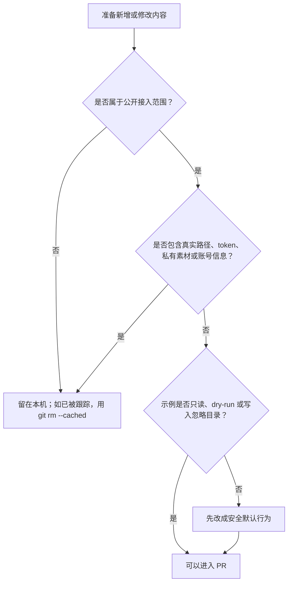
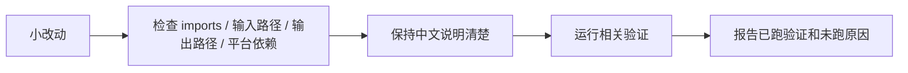
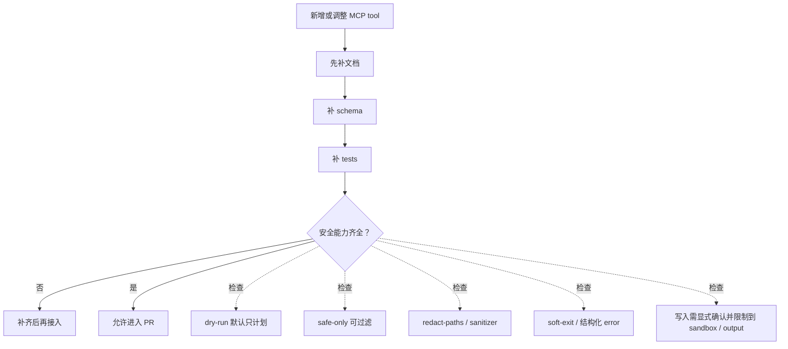

# Agent Instructions

这个仓库只做一件事：公开协作 **Codex Skill + StarBridge MCP + Adobe UXP / 本地代理接入本地创意软件**。内容要精简、中文清楚、示例可运行；历史 demo、报告脚本、素材图片、临时输出和私有资产不要发到 GitHub。

## Codex 首次接入

当用户把本仓库链接交给 Codex 并要求安装或适配时，先在仓库根目录执行：

```powershell
powershell -ExecutionPolicy Bypass -File .\bootstrap.ps1 -Profile auto
```

脚本会创建隔离 `.venv`、安装 Python/MCP 依赖、生成本机 `.codex/config.toml` 并运行 safe MCP 自检。检测到桌面软件线索时可改用 `-Profile standard`；需要全部可选依赖时使用 `-Profile all`。安装完成后让用户开启新的 Codex task 以重新加载 MCP 配置。版本适配走能力探针，不以正版校验、登录绕过或固定版本白名单阻断。

## 一图看懂



## 发布范围

| 目录或文件 | 只保留什么 |
| --- | --- |
| `.codex/skills/starbridge-*` | 服务 Codex 的 skill 入口、路由、验证命令和安全边界 |
| `docs/` | 接入协议、路线图、中文用途索引 |
| `examples/` | 公开安全的桥接状态检查和 ComfyUI API 示例 |
| `examples/photoshop_bridge/` | 通用、参数化 Photoshop 本地桥示例 |
| `uxp/` | Adobe UXP 插件原型；只保留公开、可审计、无账号和无私有素材的代码 |
| `node_proxy/` | 本地 UXP / MCP 代理示例；不保存 token、账号状态或素材路径 |
| `cad-mcp-autocad/` | AutoCAD MCP 子项目；修改前先读 README 和 `requirements.txt` |
| `scripts/` | 与 AutoCAD/CAD 自动化直接相关的脚本 |
| `AUTOCAD_MCP_SETUP.md` | AutoCAD MCP 本地配置记录 |
| `package.json` | 本地桥接检查快捷命令 |

## 不发布范围

不要提交以下内容：

- `src/`、`virtual-pet/`、`overtime-analysis-deck/` 等历史 demo 或非接入项目。
- 报告生成脚本、样式参考文档、图片素材、PPT 工作区。
- `output/`、`scratch/`、`docx_render_check/`、`.codex_video_frames/`、`.codex_video_deps/`、`node_modules/`、`__pycache__/`。
- ComfyUI 模型、LoRA、VAE、ControlNet、生成图片。
- Blender 私有 `.blend`、贴图、资产库、渲染缓存。
- CAD 客户图纸、商业 DWG、授权文件、真实项目输出。
- Photoshop / Illustrator 安装路径、Creative Cloud 缓存、PSD / AI 私有工程、商业字体、商业笔刷、购买素材、源图路径、导出结果。
- 剪映 / CapCut 草稿、缓存、导出视频、字幕原稿、客户素材、账号状态。
- 密码、token、Cookie、OAuth 缓存、浏览器资料、支付信息。

硬规则：不得提交真实路径、用户名、token、模型文件、PSD、AI、DWG、CapCut 草稿、客户素材、商业素材、授权文件，或任何可反推出本机用户和项目来源的信息。

## 修改规则



- 优先做小而清晰的变更，不做无关重构。
- 说明文字以中文为主；命令、路径、API、MCP、workflow、prompt 等必要术语可保留英文。
- 新增下载源码或安装包时，先放到本机下载收件箱；用 `STARBRIDGE_DOWNLOAD_INBOX` 做本地配置，不把真实路径写进仓库。
- Photoshop / Illustrator / UXP 示例必须通过参数或本地运行态传入输入和输出路径，不写个人路径、源图路径、桌面路径、导出目录、账号状态或私有工程默认值。
- 修改 `cad-mcp-autocad/` 时，尽量把改动限制在该子项目内。
- 不删除本机文件；清理 GitHub 发布范围时优先用 `git rm --cached`。
- 需要登录、订阅、验证码、OAuth、GitHub 授权或账号审批时，停下来让用户手动处理。

## Review 清单

- 变更是否仍在发布范围内。
- 新增文件是否含真实路径、用户名、token、Cookie、OAuth、模型文件名、PSD、AI、DWG、CapCut 草稿或客户素材线索。
- 示例命令是否默认只读、dry-run，或只写入忽略目录。
- 需要桌面软件的软件桥是否不会阻塞 Ubuntu CI。
- 文档能力描述是否和验证证据一致；未真实运行的软件不要写成已验证。
- GitHub Actions 是否优先跨平台；Windows-only、COM、GUI 或桌面软件命令只放本地验证或非阻塞 job。
- 安全扫描是否保留失败信号，不为过 CI 放宽 forbidden pattern 或扩大公开目录。

PR 结论必须说明：变更范围、已运行验证、未运行原因、是否存在私有资产泄漏风险。

## 普通客户矢量化硬规则

- 普通客户的默认顺序必须是：先做“像素级打印 / 精确重建”，再做“绘制型矢量”。
- 第一阶段使用 `exact_pixel_vector.py` 重建原始 RGBA 像素并验证无嵌入位图的 SVG，作为可复核基线。
- 第二阶段只能在第一阶段基线上使用匠心矢量或客户明确选择的智能 / 轻量矢量，生成更适合编辑的绘制型路径。
- 客户交付流程不得使用 Illustrator Image Trace /“图像描摹”，也不得在精确重建超限或失败时自动回退到图像描摹；应停止并让客户选择缩小尺寸或调整交付目标。
- 仓库保留的 Image Trace 研究、兼容和 schema 代码不得被普通客户工作流自动选择。

## 新 MCP tool 准入



新增或调整 MCP tool 前，必须先补文档、schema 和测试。不得直接接入会读取用户私有素材、模型、PSD、DWG、CapCut 草稿内容的功能。

读取类 tool 只能读取用户明确传入的公开示例，或当前软件 session 的脱敏摘要；不得递归扫描私有目录。

## 验证命令

总状态检查：

```powershell
python examples\bridge_status.py
python examples\bridge_status.py --json
python examples\bridge_status.py --json --redact-paths --soft-exit
python examples\bridge_status.py --probe-executables
```

ComfyUI 探针：

```powershell
python examples\comfy_bridge\comfy_probe.py
```

AutoCAD MCP 测试：

```powershell
python scripts\test_autocad_mcp.py
```

注意：AutoCAD 自动化需要 Windows 和本机 AutoCAD；ComfyUI 脚本需要先启动本机 ComfyUI；Photoshop 和 Illustrator 自动化需要本机已授权的 Adobe 桌面软件。
