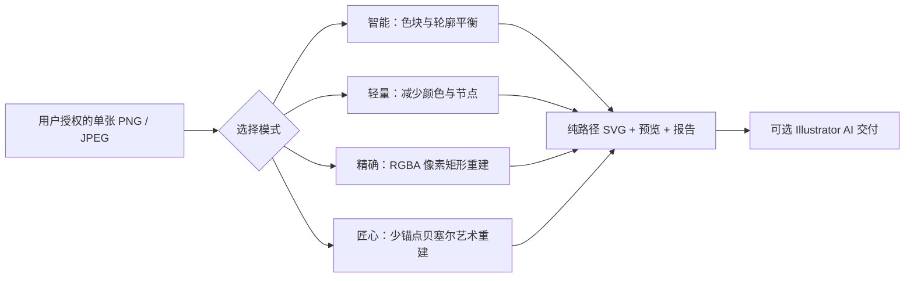
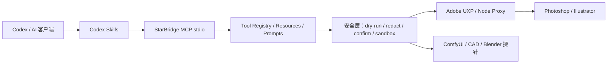

# StarBridge：匠心矢量 + 三种基础矢量模式 + Codex Skill + MCP

[](https://github.com/jianbaorui07-dot/Codex-Integration-with-Creative-Industry-Software/actions/workflows/ci.yml)


StarBridge 是以**匠心矢量**为高级方向，并完整保留**智能矢量、轻量矢量和精确重建**三种基础模式的本地创意软件开源接入层。它把 **Codex Skill** 的任务路由、**StarBridge MCP** 的结构化工具，以及 **Adobe UXP / Node Proxy** 的桌面软件通道组合成一套可审计的工作流；ComfyUI、Photoshop、CAD / AutoCAD、Blender 和 CapCut / 剪映等桥仍完整保留。

普通图片默认进入**智能矢量**；Logo、图标和纹样可选择**轻量矢量**；需要技术验证或像素存档时选择**精确重建**。在三种基础模式之上，新增加定位更高的 **匠心矢量**：保留关键角点，以更少锚点生成直线与三次贝塞尔混合轮廓，目标是逐步接近人工绘制的设计稿。所有模式都生成纯路径 SVG，并拒绝嵌入位图、脚本和外链；均不调用 Illustrator Image Trace。



项目坚持 local-first：默认只读或 `dry-run`，真实写入必须显式确认并限制在安全输出目录；仓库不保存客户素材、PSD / AI / DWG 私有工程、账号状态、模型文件、token 或本机路径。

## 当前状态：v0.1-alpha

| 状态 | 已覆盖能力 | 证据边界 |
| --- | --- | --- |
| stable（稳定） | MCP stdio、工具注册、resources / prompts、状态探针、路径脱敏、operation context、ComfyUI 队列/进度/任务快照与工作流验证；AutoCAD/DXF plan validate / dry-run / guarded write | Windows 与 Ubuntu CI 验证结构、schema、安全边界和 soft-exit |
| primary（主推） | 匠心高级模式 + 智能、轻量、精确三种基础模式→已验证 SVG、PNG 预览和报告 | 匠心模式统计锚点、控制点、曲线段、锚点减少率和轮廓误差；基础模式及旧入口完整保留 |
| experimental（其他 Adobe 协议） | Photoshop / Illustrator 规划、预检、受控执行接口；彩色矢量化 plan / validate / compare / repair_plan / execute；旧量化 SVG fallback | 兼容与研究用途；默认不作为普通图片转矢量入口；compare 只读取两个明确授权文件 |
| UXP 安全执行已实现 | Photoshop `executeAsModal` 有界排队、取消状态、history commit / rollback、临时文档自动关闭 | 已通过 Node 模拟与协议测试；仍需已授权 Photoshop 桌面实测 |
| planned（仍在推进） | repair plan → Illustrator execute → compare 的显式确认闭环、Adobe 桌面端端到端验收、Blender 确认渲染、CapCut 草稿骨架 | 未经本地运行证据，不宣称真实桌面控制已验证 |
| not implemented（不实现） | 自动登录、绕过授权、递归扫描私有目录、无确认写入真实软件、上传客户工程或商业素材 | 安全硬边界 |

Photoshop, Illustrator, Blender, and CapCut write flows are experimental or planned unless a reviewed local run proves otherwise.

完整状态见 [匠心矢量](docs/artisan-vector-mode.md)、[四模式矢量化](docs/vectorization-modes.md)、[精确像素矢量重建](docs/exact-pixel-vectorization.md)、[能力矩阵](docs/CAPABILITY_MATRIX.md) 和 [v0.1-alpha 发布说明](docs/RELEASE_V0_1_ALPHA.md)。

## 四种产品模式

| 模式 | 产品定位 | 核心处理 |
| --- | --- | --- |
| **匠心矢量（高级）** | 艺术稿、品牌图形和接近人工绘制的高级交付 | 自适应少锚点、角点保护、三次贝塞尔、轮廓误差门槛 |
| **智能矢量（默认）** | 普通插画、海报素材和设计再编辑 | 24 色默认、透明度分级、小区域清理、复合轮廓、适度节点简化 |
| **轻量矢量** | Logo、图标、纹样和流畅编辑 | 8 色默认、更强清理和简化、较低子路径/节点/文件大小上限 |
| **精确重建** | 专业验证、技术证明和像素网格存档 | 不减色、不缩放；连续同色扫描段横向与纵向合并，重建后逐像素比对 |

匠心模式的迭代目标与质量门槛见[匠心矢量文档](docs/artisan-vector-mode.md)；完整参数与输出见[四模式矢量化文档](docs/vectorization-modes.md)。

### 精确模式边界

| 阶段 | 作用 | 默认行为 |
| --- | --- | --- |
| 输入 | 一张明确授权的 PNG / JPEG | 不扫描目录、不上传云端 |
| 重建 | 连续同色像素→矩形子路径；按 RGBA paint 合并复合 path | 不缩放、不模糊、不量化颜色 |
| 验证 | 复读 SVG 尺寸、路径、颜色、透明度和 hash | 拒绝位图、脚本、外链和越界坐标 |
| AI 交付 | Illustrator 打开 SVG 并“存储为” `.ai` | 不使用图像描摹；桌面写入需明确请求 |
| 大文件写入 | 监控 Illustrator 响应和 CPU 进展，完成后核对文件 | 不因短暂未出现文件而过早中断 |

超过 4,000,000 像素、2,000,000 个矩形子路径或 64 MiB SVG verifier 限制时，流程停止并交还用户，不自动回退到 Image Trace。

## 5 分钟开始

环境：Windows 优先、Python 3.10+；仅在运行 UXP 本地代理或前端示例时需要 Node.js。

```powershell
git clone https://github.com/jianbaorui07-dot/Codex-Integration-with-Creative-Industry-Software.git
cd Codex-Integration-with-Creative-Industry-Software

python -m pip install --upgrade pip
pip install -e ".[dev]"
```

先运行不依赖桌面软件的安全检查：

```powershell
python examples\bridge_status.py --json --redact-paths --soft-exit
python -m starbridge_mcp.server tools --json --safe-only
python scripts\security_check.py
python -m unittest discover -s tests
```

安装 Node.js 后也可使用快捷命令：

```powershell
npm.cmd run bridge:status:safe
npm.cmd run starbridge:tools:safe
npm.cmd run preflight
npm.cmd test
```

PowerShell 如果拦截 `npm.ps1`，请使用 `npm.cmd`。

## 图片直接转矢量图

| 路线 | 适用场景 | 当前证据 |
| --- | --- | --- |
| **匠心矢量（高级）** | 少锚点、平滑贝塞尔、人工设计感 | 安全 `M/L/C/Z` 路径；报告锚点减少率与轮廓误差；自适应增加必要锚点 |
| **智能矢量（默认）** | 普通图片的可编辑色块和轮廓 | 统一 CLI、透明度处理、区域清理、节点简化、无嵌入位图 |
| **轻量矢量** | Logo、图标、纹样和编辑性能优先 | 更少颜色、更少碎片、更严格的路径/节点/文件大小限制 |
| **精确重建** | 原始 RGBA 像素网格→矩形复合路径 | 像素一致性验证；736×1314 本机旧样例成功生成 742,922 个子路径 AI |
| 旧量化 SVG 实验 | 旧版兼容和回归研究 | 保留兼容命令；不再作为新产品模式入口 |
| 原生 Image Trace 协议 | 研究、兼容和既有 MCP schema | 代码仍保留；普通图片转矢量工作流禁止自动选择 |

主推命令：

```powershell
python -m pip install -e ".[vectorization]"
npm.cmd run illustrator:vectorize -- --input "<input.png>" --reference-id "reference"
```

轻量和精确模式：

```powershell
npm.cmd run illustrator:vectorize -- --input "<input.png>" --mode lightweight --reference-id "reference"
npm.cmd run illustrator:vectorize -- --input "<input.png>" --mode exact --reference-id "reference"
npm.cmd run illustrator:vectorize -- --input "<input.png>" --mode artisan --reference-id "reference"
```

默认输出写入已被 Git 忽略的 `examples/output/vectorization/<reference-id>/<mode>/`，包含 `vector.svg`、`preview.png`、`parameters.json`、`vector_report.json` 和 `vector_report.md`。报告只记录脱敏 hash 和仓库相对输出路径，不返回源文件名或绝对路径。

桌面软件原型：

```powershell
python -m pip install -e ".[vector-app]"
npm.cmd run vector-app:start
```

桌面原型支持拖放、四模式卡片、参数调整、后台转换、原图/结果双预览、结果指标和打开输出目录。匠心模式额外显示锚点减少比例；基础转换不要求安装 Illustrator。

旧量化命令仍可用于兼容实验：

```powershell
npm.cmd run illustrator:vectorize:legacy-quantized -- --input "<input.png>" --commit-preset flat_16
```

复杂照片会生成很大的 SVG / AI；这是保留源像素复杂度的结果。源图与生成结果不能提交到仓库。

## 架构



- Skill 负责选择工作流、路由和验证顺序，不保存素材。
- MCP 负责稳定、结构化、可审计的工具调用与证据摘要。
- UXP / Node Proxy 负责受控桌面通道，不开放任意脚本执行。
- Photoshop、Illustrator、AutoCAD、Blender 等专业软件仍负责真实生产。

## 能力入口

| 目标 | 文档 | 验证入口 |
| --- | --- | --- |
| 项目定位 | [Skill / MCP / UXP 定位](docs/skill-mcp-uxp-positioning.md) | `python scripts\starbridge_preflight.py --markdown` |
| Photoshop | [Photoshop 接入](docs/03-codex-photoshop.md) / [UXP modal 安全协议](docs/photoshop-uxp-modal-envelope.md) | `npm.cmd run photoshop:diagnose` |
| Illustrator | [Illustrator 接入](docs/05-codex-illustrator.md) | `npm.cmd run illustrator:preflight:plan` |
| 四模式图片转 SVG | [四模式矢量化](docs/vectorization-modes.md) | `npm.cmd run illustrator:vectorize -- --input "<input.png>" --reference-id "reference"` |
| 匠心少锚点贝塞尔 | [匠心矢量](docs/artisan-vector-mode.md) | `npm.cmd run illustrator:vectorize -- --input "<input.png>" --mode artisan --reference-id "reference"` |
| 精确图片转 SVG / AI（兼容入口） | [精确像素矢量重建](docs/exact-pixel-vectorization.md) | `npm.cmd run illustrator:vectorize:offline -- --input "<input.png>" --reference-id "reference"` |
| 其他彩色矢量协议 | [参考图彩色矢量化协议](docs/color-faithful-vectorization.md) | MCP `illustrator.color_vectorize_compare` |
| ComfyUI | [ComfyUI 接入](docs/02-codex-comfyui.md) | `python examples\comfy_bridge\comfy_probe.py` |
| CAD / AutoCAD | [CAD 接入](docs/01-codex-cad.md) | `python scripts\test_autocad_mcp.py` |
| Blender | [Blender 接入](docs/04-codex-blender.md) | `npm.cmd run blender:scene:plan` |
| CapCut / 剪映 | [CapCut 接入](docs/06-codex-jianying.md) | `npm.cmd run capcut:draft:structure` |
| MCP 客户端配置 | [本地 MCP 配置](docs/local-mcp-setup.md) | `python -m starbridge_mcp.server tools --json --safe-only` |
| 中文导航 | [中文用途索引](docs/中文用途索引.md) | 按软件和目标查找入口 |

### 中文阅读指南与仓库区域标注

| 中文区域 | 对应能力 |
| --- | --- |
| 图像生成区 | ComfyUI workflow 校验、队列监控、模板和任务生命周期摘要 |
| 工程制图区 | CAD / AutoCAD plan、DXF dry-run 与受控写入 |
| AI 矢量文件桥 | 新增高定位匠心矢量；智能、轻量、精确及旧量化入口继续保留 |
| 图像编辑区 | Photoshop UXP、Node Proxy、modal 回滚与 sandbox demo |
| 视频草稿区 | CapCut / 剪映只读探针；未配置时报告“剪映可执行文件”状态 |

## 仓库结构

```text
.codex/skills/starbridge-*   Codex Skill 入口、安全边界与验证命令
starbridge_mcp/              MCP server、tool registry 与安全层
examples/                    参数化、默认安全的公开桥接示例
uxp/                         Adobe UXP 插件原型
node_proxy/                  UXP / MCP 本地代理示例
cad-mcp-autocad/             AutoCAD MCP 子项目
scripts/                     CAD 自动化与仓库验证脚本
tests/                       离线测试与安全边界测试
docs/                        接入协议、能力矩阵与中文索引
```

## 安全模型

新增或调整 MCP tool 必须先有文档、schema 和测试，并满足：

- 默认只生成计划或执行只读检查；
- `safe-only` 可过滤高风险能力；
- 输出经过路径脱敏和 sanitizer；
- 失败使用 soft-exit 或结构化 error；
- 写入必须显式确认，并限制到 sandbox / output；
- 不递归扫描私有目录，不读取未明确传入的素材或工程。

本仓库不接收 PSD、AI、DWG、`.blend`、CapCut 草稿、客户素材、模型权重、授权文件、token、Cookie、OAuth 缓存、真实安装路径或生成结果。漏洞报告方式见 [SECURITY.md](SECURITY.md)。

## 开发与验证

```powershell
python -m ruff check .
python -m ruff format --check .
python -m unittest discover -s tests
python scripts/security_check.py
python scripts/collect_bridge_status.py --json
python examples/bridge_status.py --json --redact-paths --soft-exit
python -m starbridge_mcp.server tools --json --safe-only
python -m starbridge_mcp.server evidence --init --json
python -m starbridge_mcp.server evidence --validate --json
python -m starbridge_mcp.server job-status --json
python scripts\starbridge_preflight.py --markdown
python scripts\starbridge_preflight.py --write-report --soft-exit
npm.cmd test
```

桌面软件命令需要 Windows、本机已安装且已授权的软件。Ubuntu CI 只证明跨平台逻辑、schema、安全边界和 soft-exit 通过，不代表真实软件控制已经验收。

贡献规则见 [CONTRIBUTING.md](CONTRIBUTING.md)。PR 必须说明变更范围、已运行验证、未运行原因和私有资产泄漏风险。

## 发布资料

- [Adobe 安全演示索引](docs/adobe-demo-gallery.md)
- [Adobe 演示 smoke test](docs/adobe-demo-smoke-test.md)
- [版本记录](CHANGELOG.md)
- [路线图](ROADMAP.md)
- [发布说明草稿](RELEASE_NOTES_DRAFT.md)

## English

StarBridge is a Windows-first, local-first integration layer with a premium Artisan Vector mode above three preserved baseline modes. Artisan Vector uses adaptive anchor reduction, protected corners, and mixed line/cubic Bézier paths while reporting contour error. Smart, Lightweight, and Exact Reconstruction remain available unchanged. Every mode emits raster-free SVG without Illustrator Image Trace; desktop writes require explicit confirmation.

## License

[MIT](LICENSE)
