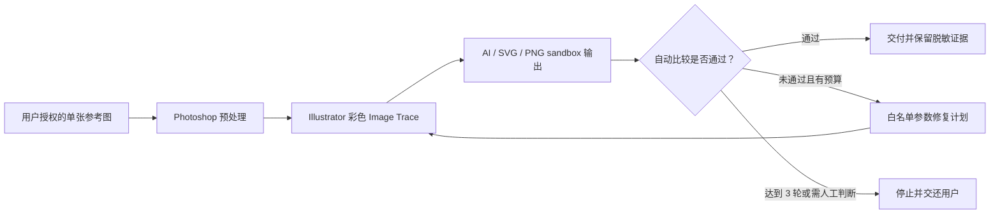
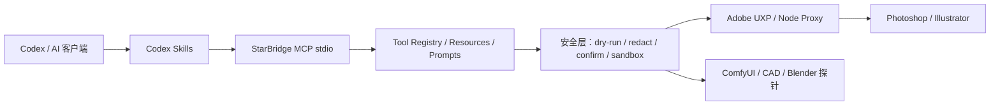

# StarBridge：Codex Skill + MCP + Adobe UXP

[](https://github.com/jianbaorui07-dot/Codex-Integration-with-Creative-Industry-Software/actions/workflows/ci.yml)


StarBridge 是面向本地创意软件的开源接入层。它把 **Codex Skill** 的任务路由、**StarBridge MCP** 的结构化工具，以及 **Adobe UXP / Node Proxy** 的桌面软件通道组合成一套可审计的工作流。

当前重点是 Adobe 生产链：把用户明确授权的参考图，经 Photoshop 安全预处理后交给 Illustrator 做彩色矢量化，再用自动指标比较原图与预览；未通过时，只调整白名单参数并生成下一轮计划，最多修复 3 轮。



项目坚持 local-first：默认只读或 `dry-run`，真实写入必须显式确认并限制在安全输出目录；仓库不保存客户素材、PSD / AI / DWG 私有工程、账号状态、模型文件、token 或本机路径。

## 当前状态：v0.1-alpha

| 状态 | 已覆盖能力 | 证据边界 |
| --- | --- | --- |
| 可稳定离线验证 | MCP stdio、工具注册、resources / prompts、状态探针、路径脱敏、operation context、ComfyUI 队列/进度/任务快照与工作流验证、AutoCAD / DXF 计划和受控写入 | Windows 与 Ubuntu CI 验证结构、schema、安全边界和 soft-exit |
| Adobe 协议已实现 | Photoshop / Illustrator 规划、预检、受控执行接口；彩色矢量化 plan / execute / compare；最多 3 轮的确定性 repair plan | 默认 dry-run；compare 只读取两个明确授权文件，输出不含路径、像素或元数据 |
| UXP 安全执行已实现 | Photoshop `executeAsModal` 有界排队、取消状态、history commit / rollback、临时文档自动关闭 | 已通过 Node 模拟与协议测试；仍需已授权 Photoshop 桌面实测 |
| 仍在推进 | repair plan → Illustrator execute → compare 的显式确认闭环、Adobe 桌面端端到端验收、Blender 确认渲染、CapCut 草稿骨架 | 未经本地运行证据，不宣称真实桌面控制已验证 |
| 不实现 | 自动登录、绕过授权、递归扫描私有目录、无确认写入真实软件、上传客户工程或商业素材 | 安全硬边界 |

完整状态见 [能力矩阵](docs/CAPABILITY_MATRIX.md)、[彩色矢量化协议](docs/color-faithful-vectorization.md) 和 [v0.1-alpha 发布说明](docs/RELEASE_V0_1_ALPHA.md)。

## Adobe 彩色矢量工作流

目标不是简单“把图片转成 SVG”，而是在安全边界内尽量保持原图的颜色、轮廓、层次和透明区域。

| 工具 | 作用 | 默认行为 |
| --- | --- | --- |
| `illustrator.color_vectorize_plan` | 生成 Photoshop / Illustrator 应用矩阵、描摹参数和质量门槛 | 纯内存 dry-run |
| `illustrator.color_vectorize_execute` | 对明确传入的 PNG / JPEG 执行固定 Image Trace，计划输出 AI / SVG / PNG | dry-run；真实写入和导出需要双确认 |
| `illustrator.color_vectorize_compare` | 计算 ICC、轮廓、色差、SSIM 与矢量证据 | 只读明确授权参考图和 sandbox PNG |
| `illustrator.color_vectorize_repair_plan` | 根据脱敏 findings 生成下一轮白名单参数 | 纯内存；最多 3 轮，不执行任意脚本 |
| Photoshop UXP modal envelope | 对受控 Photoshop 任务提供排队、取消和历史回滚 | 失败或取消时回滚，不返回路径或 descriptor |

安全停止条件：hard gate 失败、修复预算耗尽、需要主观判断或缺少明确授权时，流程必须停止并交还用户。

## 5 分钟开始

环境：Windows 优先、Python 3.10+；仅在运行 UXP 本地代理或前端示例时需要 Node.js。

```powershell
git clone https://github.com/jianbaorui07-dot/Codex-Integration-with-Creative-Industry-Software.git
cd Codex-Integration-with-Creative-Industry-Software

python -m pip install --upgrade pip
pip install -e ".[dev]"
```

先运行不依赖桌面软件的安全检查：

```powershell
python examples\bridge_status.py --json --redact-paths --soft-exit
python -m starbridge_mcp.server tools --json --safe-only
python scripts\security_check.py
python -m unittest discover -s tests
```

安装 Node.js 后也可使用快捷命令：

```powershell
npm.cmd run bridge:status:safe
npm.cmd run starbridge:tools:safe
npm.cmd run preflight
npm.cmd test
```

PowerShell 如果拦截 `npm.ps1`，请使用 `npm.cmd`。

## 架构



- Skill 负责选择工作流、路由和验证顺序，不保存素材。
- MCP 负责稳定、结构化、可审计的工具调用与证据摘要。
- UXP / Node Proxy 负责受控桌面通道，不开放任意脚本执行。
- Photoshop、Illustrator、AutoCAD、Blender 等专业软件仍负责真实生产。

## 能力入口

| 目标 | 文档 | 验证入口 |
| --- | --- | --- |
| 项目定位 | [Skill / MCP / UXP 定位](docs/skill-mcp-uxp-positioning.md) | `python scripts\starbridge_preflight.py --markdown` |
| Photoshop | [Photoshop 接入](docs/03-codex-photoshop.md) / [UXP modal 安全协议](docs/photoshop-uxp-modal-envelope.md) | `npm.cmd run photoshop:diagnose` |
| Illustrator | [Illustrator 接入](docs/05-codex-illustrator.md) | `npm.cmd run illustrator:preflight:plan` |
| 彩色矢量化 | [参考图彩色矢量化协议](docs/color-faithful-vectorization.md) | MCP `illustrator.color_vectorize_compare` |
| ComfyUI | [ComfyUI 接入](docs/02-codex-comfyui.md) | `python examples\comfy_bridge\comfy_probe.py` |
| CAD / AutoCAD | [CAD 接入](docs/01-codex-cad.md) | `python scripts\test_autocad_mcp.py` |
| Blender | [Blender 接入](docs/04-codex-blender.md) | `npm.cmd run blender:scene:plan` |
| CapCut / 剪映 | [CapCut 接入](docs/06-codex-jianying.md) | `npm.cmd run capcut:draft:structure` |
| MCP 客户端配置 | [本地 MCP 配置](docs/local-mcp-setup.md) | `python -m starbridge_mcp.server tools --json --safe-only` |
| 中文导航 | [中文用途索引](docs/中文用途索引.md) | 按软件和目标查找入口 |

## 仓库结构

```text
.codex/skills/starbridge-*   Codex Skill 入口、安全边界与验证命令
starbridge_mcp/              MCP server、tool registry 与安全层
examples/                    参数化、默认安全的公开桥接示例
uxp/                         Adobe UXP 插件原型
node_proxy/                  UXP / MCP 本地代理示例
cad-mcp-autocad/             AutoCAD MCP 子项目
scripts/                     CAD 自动化与仓库验证脚本
tests/                       离线测试与安全边界测试
docs/                        接入协议、能力矩阵与中文索引
```

## 安全模型

新增或调整 MCP tool 必须先有文档、schema 和测试，并满足：

- 默认只生成计划或执行只读检查；
- `safe-only` 可过滤高风险能力；
- 输出经过路径脱敏和 sanitizer；
- 失败使用 soft-exit 或结构化 error；
- 写入必须显式确认，并限制到 sandbox / output；
- 不递归扫描私有目录，不读取未明确传入的素材或工程。

本仓库不接收 PSD、AI、DWG、`.blend`、CapCut 草稿、客户素材、模型权重、授权文件、token、Cookie、OAuth 缓存、真实安装路径或生成结果。漏洞报告方式见 [SECURITY.md](SECURITY.md)。

## 开发与验证

```powershell
python -m ruff check .
python -m ruff format --check .
python -m unittest discover -s tests
python scripts\security_check.py
python examples\bridge_status.py --json --redact-paths --soft-exit
python -m starbridge_mcp.server tools --json --safe-only
python scripts\starbridge_preflight.py --markdown
npm.cmd test
```

桌面软件命令需要 Windows、本机已安装且已授权的软件。Ubuntu CI 只证明跨平台逻辑、schema、安全边界和 soft-exit 通过，不代表真实软件控制已经验收。

贡献规则见 [CONTRIBUTING.md](CONTRIBUTING.md)。PR 必须说明变更范围、已运行验证、未运行原因和私有资产泄漏风险。

## 发布资料

- [Adobe 安全演示索引](docs/adobe-demo-gallery.md)
- [Adobe 演示 smoke test](docs/adobe-demo-smoke-test.md)
- [版本记录](CHANGELOG.md)
- [路线图](ROADMAP.md)
- [发布说明草稿](RELEASE_NOTES_DRAFT.md)

## English

StarBridge is a Windows-first, local-first integration layer connecting AI clients to creative desktop software through Codex Skills, an MCP stdio server, and auditable Adobe UXP / local proxy bridges. Public examples default to read-only checks or dry-run plans; real writes require explicit confirmation and safe output boundaries.

## License

[MIT](LICENSE)
