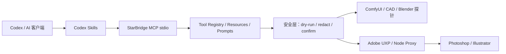

# StarBridge：Codex Skill + MCP + Adobe UXP

[](https://github.com/jianbaorui07-dot/Codex-Integration-with-Creative-Industry-Software/actions/workflows/ci.yml)


StarBridge 是一个面向本地创意软件的开源接入层，聚焦三件事：

1. 用 **Codex Skill** 描述软件工作流、路由和安全边界；
2. 用 **StarBridge MCP** 提供结构化的探针、校验、dry-run 与证据输出；
3. 用 **Adobe UXP / Node Proxy** 连接 Photoshop、Illustrator 等桌面软件。

项目坚持 local-first：默认只读或 dry-run，路径可脱敏，真实写入必须显式确认并限制在安全输出目录。仓库不保存客户素材、私有工程、账号状态、模型文件或本机路径。

## 当前状态：v0.1-alpha

| 等级 | 当前范围 |
| --- | --- |
| stable | MCP stdio、tool registry、resources/prompts、状态探针、路径脱敏、operation context、ComfyUI queue / progress / job snapshot 与 workflow validate、AutoCAD/DXF plan validate / dry-run / guarded write |
| experimental | Photoshop / Illustrator UXP 与本地代理、sandbox demo、部分桌面软件探针 |
| planned | Blender confirmed render、CapCut draft skeleton、跨软件 asset handoff |
| not implemented | 自动登录、绕过授权、读取客户私有工程、无确认写入真实桌面软件 |

Photoshop, Illustrator, Blender, and CapCut write flows are experimental or planned unless a reviewed local run proves otherwise.

完整能力与证据见 [能力矩阵](docs/CAPABILITY_MATRIX.md) 和 [v0.1-alpha 发布说明](docs/RELEASE_V0_1_ALPHA.md)。

## 5 分钟开始

环境：Windows 优先，Python 3.10+；Node.js 仅在运行 UXP 本地代理或前端示例时需要。

```powershell
git clone https://github.com/jianbaorui07-dot/Codex-Integration-with-Creative-Industry-Software.git
cd Codex-Integration-with-Creative-Industry-Software

python -m pip install --upgrade pip
pip install -e ".[dev]"
```

先运行不依赖桌面软件的安全检查：

```powershell
python examples\bridge_status.py --json --redact-paths --soft-exit
python -m starbridge_mcp.server tools --json --safe-only
python scripts\security_check.py
python -m unittest discover -s tests
```

如果已经安装 Node.js，也可以使用快捷命令：

```powershell
npm.cmd run bridge:status:safe
npm.cmd run starbridge:tools:safe
npm.cmd run preflight
npm.cmd test
```

PowerShell 若拦截 `npm.ps1`，请使用 `npm.cmd`。

## 架构



- Skill 负责选择路线和验证顺序，不保存素材。
- MCP 负责稳定、结构化、可审计的工具调用。
- UXP / Node Proxy 负责桌面软件通道，不开放任意脚本执行。
- 专业软件仍负责真实生产；StarBridge 不替代 Photoshop、Illustrator、AutoCAD 或 Blender。

## 能力入口

| 目标 | 文档 | 安全验证 |
| --- | --- | --- |
| 总体定位 | [Skill / MCP / UXP 定位](docs/skill-mcp-uxp-positioning.md) | `python scripts\starbridge_preflight.py --markdown` |
| Codex 跨软件控制 | [控制规划器](docs/codex-software-control-planner.md) | MCP `starbridge.control_plan` |
| 操作状态闭环 | [Operation Context Envelope](docs/operation-context-envelope.md) | MCP `starbridge.operation_context` |
| ComfyUI 队列背压 | [只读 Queue Snapshot](docs/comfyui-queue-snapshot.md) | MCP `comfyui.queue_snapshot` |
| ComfyUI 实时进度 | [实时进度监控](docs/comfyui-progress-monitor.md) | MCP `comfyui.progress_monitor`；默认 plan-only，live 仅直接 loopback `/ws` |
| ComfyUI 断线后状态 | [任务状态快照](docs/comfyui-job-snapshot.md) | MCP `comfyui.job_snapshot`；按显式 UUID 单任务查询，只返回脱敏终态摘要 |
| 同类项目差距 | [先进能力与迭代优先级](docs/competitive-gap-analysis.md) | MCP `comfy.workflow_visualize` |
| MCP 客户端接入 | [本地 MCP 配置](docs/local-mcp-setup.md) | `python -m starbridge_mcp.server tools --json --safe-only` |
| ComfyUI | [ComfyUI 接入](docs/02-codex-comfyui.md) | `python examples\comfy_bridge\comfy_probe.py` |
| CAD / AutoCAD | [CAD 接入](docs/01-codex-cad.md) | `python scripts\test_autocad_mcp.py` |
| Photoshop | [Photoshop 接入](docs/03-codex-photoshop.md) | `npm.cmd run photoshop:diagnose` |
| Illustrator | [Illustrator 接入](docs/05-codex-illustrator.md) | `npm.cmd run illustrator:preflight:plan` |
| Blender | [Blender 接入](docs/04-codex-blender.md) | `npm.cmd run blender:scene:plan` |
| CapCut / 剪映 | [CapCut 接入](docs/06-codex-jianying.md) | `npm.cmd run capcut:draft:structure` |

不知道从哪里开始时，先看 [中文用途索引](docs/中文用途索引.md)。

### 中文阅读指南与仓库区域标注

| 中文区域 | 对应能力 |
| --- | --- |
| 图像生成区 | ComfyUI workflow 校验、模板和生命周期摘要 |
| 工程制图区 | CAD / AutoCAD plan、DXF dry-run 与受控写入 |
| AI 矢量文件桥 | Illustrator preflight、UXP 与本地代理 |
| 图像编辑区 | Photoshop UXP、Node Proxy 与 sandbox demo |
| 视频草稿区 | CapCut / 剪映只读探针；未配置时报告“剪映可执行文件”状态 |

## 仓库结构

```text
.codex/skills/starbridge-*   Codex Skill 入口与安全路由
starbridge_mcp/              MCP server、tool registry 与安全层
examples/                    公开、参数化、默认安全的桥接示例
uxp/                         Adobe UXP 插件原型
node_proxy/                  UXP / MCP 本地代理示例
cad-mcp-autocad/             AutoCAD MCP 子项目
scripts/                     CAD 自动化与仓库验证脚本
tests/                       离线测试与安全边界测试
docs/                        接入协议、能力矩阵与中文索引
```

## 安全模型

所有新增或调整的 MCP tool 都必须先有文档、schema 和测试，并满足：

- dry-run 默认只生成计划；
- safe-only 能过滤高风险能力；
- 输出支持路径脱敏与 sanitizer；
- 失败使用 soft-exit 或结构化 error；
- 写入需要显式确认，并限制到 sandbox / output；
- 不递归扫描私有目录，不读取未明确传入的素材或工程。

本仓库不会接收 PSD、AI、DWG、`.blend`、CapCut 草稿、客户素材、模型权重、授权文件、token、Cookie、OAuth 缓存、真实安装路径或生成结果。

安全策略和漏洞报告方式见 [SECURITY.md](SECURITY.md)。

## 开发与验证

提交前至少运行：

```powershell
python -m ruff check .
python -m ruff format --check .
python -m unittest discover -s tests
python scripts/security_check.py
python scripts/collect_bridge_status.py --json
python examples/bridge_status.py --json --redact-paths --soft-exit
python -m starbridge_mcp.server tools --json --safe-only
python -m starbridge_mcp.server evidence --init --json
python -m starbridge_mcp.server evidence --validate --json
python -m starbridge_mcp.server job-status --json
python scripts\starbridge_preflight.py --markdown
python scripts\starbridge_preflight.py --write-report --soft-exit
```

桌面软件相关命令需要 Windows、本机已安装且已授权的软件；Ubuntu CI 只验证跨平台逻辑、schema、安全边界和 soft-exit，不代表真实软件控制已经验证。

贡献规则见 [CONTRIBUTING.md](CONTRIBUTING.md)。PR 必须说明变更范围、已运行验证、未运行原因和私有资产泄漏风险。

## 发布资料

- [Adobe 安全演示索引](docs/adobe-demo-gallery.md)
- [Adobe 演示 smoke test](docs/adobe-demo-smoke-test.md)
- [版本记录](CHANGELOG.md)
- [路线图](ROADMAP.md)
- [发布说明草稿](RELEASE_NOTES_DRAFT.md)

## English

StarBridge is a Windows-first, local-first integration layer connecting AI clients to creative desktop software through Codex Skills, an MCP stdio server, and auditable Adobe UXP / local proxy bridges. Public examples default to read-only checks or dry-run plans; real writes require explicit confirmation and safe output boundaries.

## License

[MIT](LICENSE)
