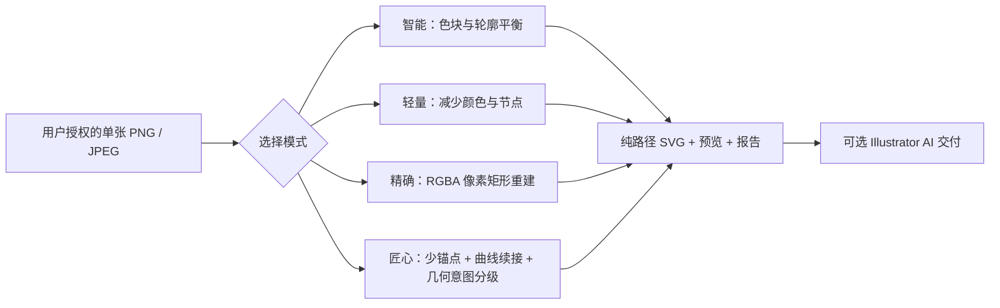
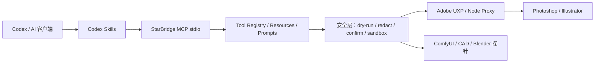

# StarBridge：匠心矢量 + 四模式矢量化 + Codex Skill + MCP

Artisan 现已支持以最终 SVG 原分辨率渲染为准的自适应少锚点优化：默认结构差异不高于 15%、归一化 MAE 不高于 0.06、边缘 Dice 不低于 0.92，合格后按锚点、子路径、文件大小和耗时选优；未通过时保留原 Artisan 基准。详见 [自适应矢量优化](docs/adaptive-vector-optimization.md)。

[](https://github.com/jianbaorui07-dot/Codex-Integration-with-Creative-Industry-Software/actions/workflows/ci.yml)


StarBridge 是以**匠心矢量**为高级方向，并完整保留**智能矢量、轻量矢量和精确重建**三种基础模式的本地创意软件开源接入层。它把 **Codex Skill** 的任务路由、**StarBridge MCP** 的结构化工具，以及 **Adobe UXP / Node Proxy** 的桌面软件通道组合成一套可审计的工作流；ComfyUI、Photoshop、CAD / AutoCAD、Blender 和 CapCut / 剪映等桥仍完整保留。项目支持从仓库链接开始的 3 分钟适配：自动创建隔离环境、安装匹配依赖、生成项目级 Codex MCP 配置并执行安全自检。

普通客户固定先走**像素级打印 / 精确重建**，把原始 RGBA 像素重建并验证为无嵌入位图的 SVG；需要更适合编辑的路径时，再以这份已验证基线进入**绘制型矢量**，优先使用匠心矢量，或按客户明确目标选择智能 / 轻量矢量。**客户交付禁止使用 Illustrator Image Trace / 图像描摹，也禁止在精确重建超限时自动回退到图像描摹。**在三种基础模式之上，**匠心矢量**保留关键角点，以更少锚点生成直线、三次贝塞尔轮廓和人工描线式开放描边，并按切线与线宽把交叉点两侧续接成长路径。第 5 轮按局部几何把描边分成主轮廓、装饰纹、细节和微细节；第 6 轮增加客户意图预校准、矢量到矢量局部精修和可审计补丁链；第 7 轮安全合并非重叠叶子块面并压缩近似色；第 8 轮让客户明确颜色组和设计命名；第 9 轮增加确认式 Illustrator 应用、回读、提交和回滚协议。它只使用可解释的几何特征，不声称识别人脸、文字或具体题材。



项目坚持 local-first：默认只读或 `dry-run`，真实写入必须显式确认并限制在安全输出目录；仓库不保存客户素材、PSD / AI / DWG 私有工程、账号状态、模型文件、token 或本机路径。

## Codex 快速版本协同

仓库新增自包含的 `starbridge-version-coordinator` 插件，用于把客户的 Photoshop、Illustrator、AutoCAD、Blender、ComfyUI、CapCut / 剪映版本映射到基于能力探针的 StarBridge 路由，并把 v5-v8 工作流增量迁移到 v9。版本号只作协同信息，不作为正版校验或固定版本白名单；协调器只生成计划，真实写入仍交给完整 StarBridge MCP 并要求显式确认。

```powershell
npm.cmd run codex:coordinator:self-test
npm.cmd run codex:coordinator:install:dry-run
powershell -ExecutionPolicy Bypass -File plugins\starbridge-version-coordinator\scripts\install.ps1
```

完整安装、软件版本矩阵和迁移规则见 [Codex 版本配置协同服务](docs/codex-version-coordination-service.md)。

## 当前状态：v0.1-alpha（能力矩阵 v0.2）

| 状态 | 已覆盖能力 | 证据边界 |
| --- | --- | --- |
| stable（稳定） | MCP stdio、tools / resources / prompts、工具注册、状态探针、路径脱敏、safe roots、operation context、EvidenceManifest / JobStatus；ComfyUI 队列/进度/任务快照与工作流验证；AutoCAD/DXF plan validate / dry-run / guarded write | Windows 与 Ubuntu CI 验证结构、schema、安全边界、证据字段和 soft-exit |
| primary（主推） | 四模式图片转 SVG：匠心、智能、轻量、精确；均输出已验证的无位图 SVG、矢量采样预览和报告 | 匠心 Iteration 9 增加确认式 Illustrator 命名应用、状态 revision 门、回读/提交/回滚事务；基础模式及旧入口完整保留 |
| experimental（桌面与 Adobe 协议） | Photoshop session / state / preview、sandbox recipe 计划；Illustrator 预检、精确 SVG→AI 交付和保留的彩色矢量化 / Image Trace / 旧量化协议 | CLI、verifier、schema 和协议测试已覆盖；真实桌面写入仍需本机软件、明确授权和显式确认 |
| UXP 安全执行已实现 | Photoshop `executeAsModal` 有界排队、取消状态、history commit / rollback、临时文档自动关闭 | 已通过 Node 模拟与协议测试；仍需已授权 Photoshop 桌面实测 |
| prototype（原型） | Blender 环境/场景/参考重建计划；CapCut / 剪映可执行文件探针和脱敏草稿顶层摘要 | 只验证公开结构和安全边界；不读取私有工程，不把探针结果写成生产控制 |
| planned（仍在推进） | repair plan → Illustrator execute → compare 的显式确认闭环、事务式 AI 发布、Adobe 桌面端端到端验收、Blender 确认渲染、CapCut 草稿骨架 | 未经本地运行证据，不宣称真实桌面控制已验证 |
| not implemented（不实现） | 自动登录、绕过授权、递归扫描私有目录、无确认写入真实软件、上传客户工程或商业素材 | 安全硬边界 |

Photoshop, Illustrator, Blender, and CapCut write flows are experimental or planned unless a reviewed local run proves otherwise.

完整状态见 [匠心矢量](docs/artisan-vector-mode.md)、[四模式矢量化](docs/vectorization-modes.md)、[精确像素矢量重建](docs/exact-pixel-vectorization.md)、[能力矩阵](docs/CAPABILITY_MATRIX.md) 和 [v0.1-alpha 发布说明](docs/RELEASE_V0_1_ALPHA.md)。

## 新增：智能曲线精修 Skill

`.codex/skills/starbridge-smart-vector-refinement/` 把“发现结果破碎或差异过大后的修复过程”整理为可复用质量闭环：保留原结果，生成 bounded stacked-spline 曲线候选，规范化为安全 `M/L/C/Z` 路径，验证无位图/无外链，再比较原图与**最终 SVG 实际渲染图**。默认拒绝结构差异高于 30%、归一化 MAE 高于 0.12、子路径或锚点超限的候选；不会把内部量化预览分数冒充 SVG 交付质量，也不会调用 Illustrator Image Trace。

## 最新能力：匠心矢量 Iteration 9

第 9 轮把第 8 轮的 Illustrator 映射接入本地事务协议，但仍不绕过用户确认：

- `probe` 只返回代理是否就绪、活动文档是否存在和短 `state_revision`，不返回文档名、图层名、路径或画面内容。
- 应用计划同时绑定 SVG SHA-256、`edit_ref`、`direction_ref`、`imap_ref` 和当前状态 revision，并生成独立 `approval_ref`；计划小于 1 KB，不包含客户名称或文件路径。
- 只有 `confirm_write=true` 与正确 `approval_ref` 同时存在才会调用本机代理；会话变化、状态过期、映射串用或代理缺失都不会写入。
- UXP 主机先解析全部 `layer-* / shape-*` 目标，再一次性改名；目标缺失、重复、锁定或隐藏时不做部分写入。
- 完整事务为“应用 → 回读计数 → 提交回滚快照”；回读或提交失败时自动回滚。执行回执只保留短引用、计数和状态。

跨平台测试验证了确认拒绝、陈旧 revision、代理 soft-exit、成功提交、回读失败回滚、提交失败回滚、缺失目标不部分改名，以及真实本地 HTTP/WebSocket 代理的白名单与 revision 门。当前没有在已授权 Illustrator 桌面中执行真实写入，因此能力边界仍是“协议和 headless 主机模拟已验证，桌面实测待明确授权”。

### Iteration 8 基线

第 8 轮把“先问客户，再按人工意图处理”落实为紧凑、不可串用的本地协议：

- 客户选择 `manual-groups` 后，单独提交颜色组、对象名和设计层名；系统不根据图片擅自猜测客户配色。
- 人工指令同时绑定基础 `edit_ref` 与风格 `profile_ref`，并生成 `direction_ref`；内容、摘要或绑定被修改时完整性校验会失败。
- 手动颜色组仍受基础色保护、非重叠叶子块面合并、源子路径/锚点不变和未选路径逐字节一致等第 7 轮硬门槛保护。
- 被合并对象的客户命名会安全转移到保留对象；同一合并组出现两个不同人工名称时拒绝发布，不替客户做选择。
- 新增 `artisan_illustrator_map.json`，绑定输出 SVG 哈希、新 `edit_ref` 和 `direction_ref`；真实 Illustrator 写入仍要求用户确认，本轮不宣称已执行桌面写入。

跨平台合成夹具中，显式人工颜色组把选中块面从 5 减到 3、颜色和 paint 从 4 减到 3，同时保持 6 个子路径、22 个锚点、基础色、重叠块和未选描边。人工指令和 Illustrator 映射均小于 900 bytes，后续请求只需短引用，不必重复上传图片或完整 SVG。

### Iteration 7 基线

第 7 轮把“更少块面、更克制的颜色”变成可复用并可验证的矢量后处理：

- 风格配置 schema v2 明确区分保留调色板、归并近似色、单色和手动分组；默认仍保留调色板，只有客户明确选择后才改变颜色。
- 只合并同图层角色、同深度、同父对象、同目标 paint 的无子对象叶子块面；任何边界框重叠候选都拒绝合并，避免 `evenodd` 复合路径把重叠区翻成孔洞。
- 基础/纸张颜色始终保护；近色归并使用本地 CIELAB Delta-E 门槛，完整源图和 SVG 不发送给外部 AI。
- 发布前逐字节核对源子路径多重集与未选路径，并硬性保持子路径、锚点和描边数量；块面、颜色或 paint 没有真实减少时不发布补丁。
- 输出新 `edit_ref`、短 `patch_ref` 和父补丁引用，后续迭代只需交换局部引用，不必重复上传图片或完整矢量结构。

跨平台合成夹具用于证明规则本身，而不是证明某张示例图：近色策略把选中块面从 5 减到 3（-40%）、全图路径从 6 减到 4、颜色和 paint 从 4 减到 3；6 个子路径、22 个锚点、基础色、重叠块面和未选描边保持不变。保留调色板策略仍可把完全同色且不重叠的选中块面从 5 减到 4，同时颜色数不变。

### Iteration 6 基线

第 6 轮把一次转换升级为可复用的设计修订过程：

- 先用三个短问题确认细节、布线和颜色策略，再编译为小于 1 KB、可复用的本地风格配置；这是确定性的参数预校准，不是模型训练，也不上传图片。
- `artisan_edit_index.json` 升级到 schema v2，绑定基础 SVG 的 SHA-256，并为每个对象增加设计师可读名称和父补丁引用，避免把修订应用到错误文件。
- 新增真正的矢量到矢量局部精修：只改 `intent:*` 或 `shape-*` 选中的开放描边，按曲率重新分配锚点；端点、路径数、子路径数、颜色数、paint 数、未选路径和选中对象样式均设为硬约束。
- 每条候选独立检查最大/平均几何偏差、新增自交和回头线；不合格的子路径保留原始几何，整组没有安全收益时明确拒绝输出。
- 每次修订生成紧凑 `patch_ref`、新 `edit_ref` 和补丁链，无需重新上传原图或把完整结构塞回对话。

授权线稿仅作为可替换的回归样例。Iteration 6 在主轮廓局部修订中把通过质量门的 6 个对象从 3,178 个锚点减到 2,922 个（-8.06%），全图总锚点从 24,879 减到 24,623；111 条路径、8,065 个子路径、2 种颜色和 2 种 paint 均未改变，未选路径逐字节一致。样图与结果仍只保存在 Git 忽略目录，仓库提交的是过程、约束、测试和可复用代码。

### Iteration 5 基线

第 5 轮已完成并默认受质量门控保护：

- 根据曲线长度、闭合性和转折密度生成 `flow-contour`、`ornament`、`detail`、`micro-detail` 四类几何意图；这是局部几何分类，不是内容识别。
- 增加覆盖感知的微短枝清理和独立的第 4 个质量门；候选失败时按“几何意图 → 曲线续接 → 中心线 → 轮廓填充”逐级回退。
- 生成矢量采样预览、schema-v3 意图元数据、稳定 `intent:*` 选择器，以及不含源文件名和绝对路径的 `artisan_edit_index.json`。
- `--compact` 只返回质量指标、`edit_ref`、选择器和本地输出引用；完整报告仍留在被 Git 忽略的输出目录。

同一份明确授权的本地样例回归结果如下；这些数字只说明当前算法在该样例上的证据，不代表所有图片风格的固定性能：

| 指标 | Iteration 4 | Iteration 5 | 变化 |
| --- | ---: | ---: | ---: |
| 中心线锚点 | 30,813 | 24,875 | -19.27% |
| 子路径 | 10,309 | 8,064 | -21.78% |
| 可编辑批次 | 116 | 110 | -5.17% |
| SVG 大小 | 1,014,783 bytes | 861,890 bytes | -15.07% |
| 召回率 / Dice | 94.04% / 74.71% | 93.13% / 74.54% | 质量门内 |

## 四种产品模式

| 模式 | 产品定位 | 核心处理 |
| --- | --- | --- |
| **匠心矢量（高级）** | 艺术稿、品牌图形和接近人工绘制的高级交付 | 自适应少锚点、中心线描边、交叉点曲线续接、几何意图分级、四级质量门控与安全回退 |
| **智能矢量（客户明确选择）** | 普通插画、海报素材和设计再编辑 | 24 色默认、透明度分级、小区域清理、复合轮廓、适度节点简化 |
| **轻量矢量** | Logo、图标、纹样和流畅编辑 | 8 色默认、更强清理和简化、较低子路径/节点/文件大小上限 |
| **精确重建** | 专业验证、技术证明和像素网格存档 | 不减色、不缩放；连续同色扫描段横向与纵向合并，重建后逐像素比对 |

匠心模式的迭代目标与质量门槛见[匠心矢量文档](docs/artisan-vector-mode.md)；完整参数与输出见[四模式矢量化文档](docs/vectorization-modes.md)。

### 精确模式边界

| 阶段 | 作用 | 默认行为 |
| --- | --- | --- |
| 输入 | 一张明确授权的 PNG / JPEG | 不扫描目录、不上传云端 |
| 重建 | 连续同色像素→矩形子路径；按 RGBA paint 合并复合 path | 不缩放、不模糊、不量化颜色 |
| 验证 | 复读 SVG 尺寸、路径、颜色、透明度和 hash | 拒绝位图、脚本、外链和越界坐标 |
| AI 交付 | Illustrator 打开 SVG 并“存储为” `.ai` | 不使用图像描摹；桌面写入需明确请求 |
| 大文件写入 | 监控 Illustrator 响应和 CPU 进展，完成后核对文件 | 不因短暂未出现文件而过早中断 |

超过 4,000,000 像素、2,000,000 个矩形子路径或 64 MiB SVG verifier 限制时，流程停止并交还用户，不自动回退到 Image Trace。

## 3 分钟适配：仓库链接 → Codex → 可运行环境

环境：Windows 优先、Python 3.10+；仅在安装 `standard` / `all` 档位或运行 UXP 本地代理时需要 Node.js。把仓库链接直接交给 Codex 后，让它执行：

```powershell
powershell -ExecutionPolicy Bypass -File .\bootstrap.ps1 -Profile auto
```

这条命令会创建隔离 `.venv`、安装可复用的 Python/MCP 与无桌面矢量依赖、生成项目级 `.codex/config.toml`，并运行安全自检。检测到本机桌面软件线索时会自动选择 `standard`；需要全部可选依赖时使用 `-Profile all`。完整的 Codex 复制提示词、从 URL 克隆入口和版本说明见 [CODEX_SETUP.md](CODEX_SETUP.md)。

如果仓库已经在本机，也可以直接运行：

```powershell
npm.cmd run install:quick
```

从 Git URL 克隆并安装：

```powershell
powershell -ExecutionPolicy Bypass -File .\scripts\install-from-url.ps1 `
  -RepositoryUrl "https://github.com/jianbaorui07-dot/Codex-Integration-with-Creative-Industry-Software.git"
```

先运行不依赖桌面软件的安全检查（quickstart 已包含前三项）：

```powershell
python examples\bridge_status.py --json --redact-paths --soft-exit
python -m starbridge_mcp.server tools --json --safe-only
python scripts\security_check.py
python -m unittest discover -s tests
```

安装 Node.js 后也可使用快捷命令：

```powershell
npm.cmd run bridge:status:safe
npm.cmd run starbridge:tools:safe
npm.cmd run preflight
npm.cmd test
```

PowerShell 如果拦截 `npm.ps1`，请使用 `npm.cmd`。

## 图片直接转矢量图

| 路线 | 适用场景 | 当前证据 |
| --- | --- | --- |
| **匠心矢量（高级）** | 少锚点、平滑贝塞尔、人工设计感 | 闭合 `M/L/C/Z` 填充 + 开放 `M/L/C` 描边；稳定形状 ID；中心线质量门控；轮廓填充回退 |
| **智能矢量（客户明确选择）** | 普通图片的可编辑色块和轮廓 | 统一 CLI、透明度处理、区域清理、节点简化、无嵌入位图 |
| **轻量矢量** | Logo、图标、纹样和编辑性能优先 | 更少颜色、更少碎片、更严格的路径/节点/文件大小限制 |
| **精确重建** | 原始 RGBA 像素网格→矩形复合路径 | 像素一致性验证；736×1314 本机旧样例成功生成 742,922 个子路径 AI |
| 旧量化 SVG 实验 | 旧版兼容和回归研究 | 保留兼容命令；不再作为新产品模式入口 |
| 原生 Image Trace 协议 | 研究、兼容和既有 MCP schema | 代码仍保留；普通图片转矢量工作流禁止自动选择 |

主推命令：

```powershell
python -m pip install -e ".[vectorization]"
npm.cmd run illustrator:vectorize -- --input "<input.png>" --reference-id "reference"
```

轻量和精确模式：

```powershell
npm.cmd run illustrator:vectorize -- --input "<input.png>" --mode lightweight --reference-id "reference"
npm.cmd run illustrator:vectorize -- --input "<input.png>" --mode exact --reference-id "reference"
npm.cmd run illustrator:vectorize -- --input "<input.png>" --mode artisan --reference-id "reference"
```

Codex 或其他代理调用时可追加 `--compact`，只返回关键质量指标、输出位置、`edit_ref` 和意图选择器；完整报告仍保存在本地输出目录，从源头减少重复上下文和 token。

默认输出写入已被 Git 忽略的 `examples/output/vectorization/<reference-id>/<mode>/`，包含 `vector.svg`、矢量采样 `preview.png`、参数和报告；匠心模式额外生成完整 `artisan_structure.json` 与紧凑 `artisan_edit_index.json`。后续修改优先使用 `edit_ref + intent:* / shape-*`，无需加载完整结构或重新描述图片。报告只记录脱敏 hash 和仓库相对输出路径，不返回源文件名或绝对路径。

```powershell
python -m starbridge_mcp.vectorization.artisan_edit `
  --index "<output>/artisan_edit_index.json" `
  --selector intent:flow-contour
```

桌面软件原型：

```powershell
python -m pip install -e ".[vector-app]"
npm.cmd run vector-app:start
```

桌面原型支持拖放、四模式卡片、参数调整、后台转换、原图/结果双预览、结果指标和打开输出目录。匠心模式显示设计图层、独立形状、锚点减少比例和紧凑结构引用；基础转换不要求安装 Illustrator。

旧量化命令仍可用于兼容实验：

```powershell
npm.cmd run illustrator:vectorize:legacy-quantized -- --input "<input.png>" --commit-preset flat_16
```

复杂照片会生成很大的 SVG / AI；这是保留源像素复杂度的结果。源图与生成结果不能提交到仓库。

## 架构



- Skill 负责选择工作流、路由和验证顺序，不保存素材。
- MCP 负责稳定、结构化、可审计的工具调用与证据摘要。
- UXP / Node Proxy 负责受控桌面通道，不开放任意脚本执行。
- Photoshop、Illustrator、AutoCAD、Blender 等专业软件仍负责真实生产。

## 能力入口

| 目标 | 文档 | 验证入口 |
| --- | --- | --- |
| 项目定位 | [Skill / MCP / UXP 定位](docs/skill-mcp-uxp-positioning.md) | `python scripts\starbridge_preflight.py --markdown` |
| Photoshop | [Photoshop 接入](docs/03-codex-photoshop.md) / [UXP modal 安全协议](docs/photoshop-uxp-modal-envelope.md) | `npm.cmd run photoshop:diagnose` |
| Illustrator | [Illustrator 接入](docs/05-codex-illustrator.md) | `npm.cmd run illustrator:preflight:plan` |
| 四模式图片转 SVG | [四模式矢量化](docs/vectorization-modes.md) | `npm.cmd run illustrator:vectorize -- --input "<input.png>" --reference-id "reference"` |
| 匠心少锚点贝塞尔 | [匠心矢量](docs/artisan-vector-mode.md) | `npm.cmd run illustrator:vectorize -- --input "<input.png>" --mode artisan --reference-id "reference"` |
| 精确图片转 SVG / AI（兼容入口） | [精确像素矢量重建](docs/exact-pixel-vectorization.md) | `npm.cmd run illustrator:vectorize:offline -- --input "<input.png>" --reference-id "reference"` |
| 其他彩色矢量协议 | [参考图彩色矢量化协议](docs/color-faithful-vectorization.md) | MCP `illustrator.color_vectorize_compare` |
| ComfyUI | [ComfyUI 接入](docs/02-codex-comfyui.md) | `python examples\comfy_bridge\comfy_probe.py` |
| CAD / AutoCAD | [CAD 接入](docs/01-codex-cad.md) | `python scripts\test_autocad_mcp.py` |
| Blender | [Blender 接入](docs/04-codex-blender.md) | `npm.cmd run blender:scene:plan` |
| CapCut / 剪映 | [CapCut 接入](docs/06-codex-jianying.md) | `npm.cmd run capcut:draft:structure` |
| MCP 客户端配置 | [本地 MCP 配置](docs/local-mcp-setup.md) | `python -m starbridge_mcp.server tools --json --safe-only` |
| 中文导航 | [中文用途索引](docs/中文用途索引.md) | 按软件和目标查找入口 |

### 中文阅读指南与仓库区域标注

| 中文区域 | 对应能力 |
| --- | --- |
| 图像生成区 | ComfyUI workflow 校验、队列监控、模板和任务生命周期摘要 |
| 工程制图区 | CAD / AutoCAD plan、DXF dry-run 与受控写入 |
| AI 矢量文件桥 | 匠心 Iteration 5、几何意图选择器、局部编辑索引；智能、轻量、精确及旧量化入口继续保留 |
| 图像编辑区 | Photoshop session / preview / state、UXP、Node Proxy、modal 回滚与 sandbox recipe |
| 视频草稿区 | CapCut / 剪映只读探针；未配置时报告“剪映可执行文件”状态 |

## 仓库结构

```text
.codex/skills/starbridge-*   Codex Skill 入口、安全边界与验证命令
starbridge_mcp/              MCP server、tool registry 与安全层
examples/                    参数化、默认安全的公开桥接示例
uxp/                         Adobe UXP 插件原型
node_proxy/                  UXP / MCP 本地代理示例
cad-mcp-autocad/             AutoCAD MCP 子项目
scripts/                     CAD 自动化与仓库验证脚本
tests/                       离线测试与安全边界测试
docs/                        接入协议、能力矩阵与中文索引
```

## 安全模型

新增或调整 MCP tool 必须先有文档、schema 和测试，并满足：

- 默认只生成计划或执行只读检查；
- `safe-only` 可过滤高风险能力；
- 输出经过路径脱敏和 sanitizer；
- 失败使用 soft-exit 或结构化 error；
- 写入必须显式确认，并限制到 sandbox / output；
- 不递归扫描私有目录，不读取未明确传入的素材或工程。

本仓库不接收 PSD、AI、DWG、`.blend`、CapCut 草稿、客户素材、模型权重、授权文件、token、Cookie、OAuth 缓存、真实安装路径或生成结果。漏洞报告方式见 [SECURITY.md](SECURITY.md)。

## 开发与验证

```powershell
python -m ruff check .
python -m ruff format --check .
python -m unittest discover -s tests
python scripts/security_check.py
python scripts/collect_bridge_status.py --json
python examples/bridge_status.py --json --redact-paths --soft-exit
python -m starbridge_mcp.server tools --json --safe-only
python -m starbridge_mcp.server evidence --init --json
python -m starbridge_mcp.server evidence --validate --json
python -m starbridge_mcp.server job-status --json
python scripts\starbridge_preflight.py --markdown
python scripts\starbridge_preflight.py --write-report --soft-exit
npm.cmd test
```

桌面软件命令需要 Windows、本机已安装且已授权的软件。Ubuntu CI 只证明跨平台逻辑、schema、安全边界和 soft-exit 通过，不代表真实软件控制已经验收。

贡献规则见 [CONTRIBUTING.md](CONTRIBUTING.md)。PR 必须说明变更范围、已运行验证、未运行原因和私有资产泄漏风险。

## 发布资料

- [Adobe 安全演示索引](docs/adobe-demo-gallery.md)
- [Adobe 演示 smoke test](docs/adobe-demo-smoke-test.md)
- [版本记录](CHANGELOG.md)
- [路线图](ROADMAP.md)
- [发布说明草稿](RELEASE_NOTES_DRAFT.md)

## English

StarBridge is a Windows-first, local-first integration layer with a premium Artisan Vector mode above three preserved baseline modes. Artisan Vector now includes geometry-only intent profiles, tangent-aware continuation, quality-gated fallbacks, stable edit selectors, and a compact local edit index. Smart, Lightweight, and Exact Reconstruction remain available unchanged. Every mode emits verified raster-free SVG; ordinary image vectorization does not select Illustrator Image Trace, and desktop writes require explicit confirmation.

## License

[MIT](LICENSE)
