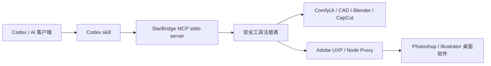

# 星桥三联：StarBridge Skill + MCP + UXP

[](https://github.com/jianbaorui07-dot/Codex-Integration-with-Creative-Industry-Software/actions/workflows/ci.yml)


## 仓库总定位

这个仓库只服务三件事：**Codex skill 入口、StarBridge MCP 工具协议、Adobe UXP / 本地代理桥**。所有公开内容都围绕这三层收敛；历史 demo、私有素材、真实工程、本机路径、账号状态和临时输出不进入 GitHub。

| 层级 | 服务对象 | 当前职责 | 边界 |
| --- | --- | --- | --- |
| Skill | Codex 工作流 | 把 Photoshop、Illustrator、CAD、Blender 等软件接入流程拆成可复用 skill | 只写方法、路由和安全规则，不保存私有素材 |
| MCP | AI 客户端工具协议 | 暴露 `tools/list`、`tools/call`、safe-only registry、status/probe、dry-run 和 evidence | 默认只读或 dry-run，写入必须确认并限制到 sandbox |
| UXP | Adobe 桌面插件 / 本地代理 | 承接 Photoshop UXP v2、Node Proxy、typed BatchPlay、DOM 读写实验 | 仍是 experimental，不开放任意脚本或私有 PSD 自动处理 |

一句话原则：**Skill 管路线，MCP 管工具，UXP / Node Proxy 管 Adobe 本地插件通道，Safety layer 管脱敏和发布边界，专业软件继续负责真实生产。**

## 项目状态：v0.1-alpha

| 状态 | 当前范围 |
| --- | --- |
| stable | MCP stdio server、tool registry、统一 status/probe、路径脱敏、安全检查、preflight、ComfyUI workflow validate、AutoCAD/DXF plan validate / dry-run / guarded write。 |
| experimental | Photoshop sandbox 写入/导出 demo、Illustrator sandbox trace/export demo、ComfyUI txt2img job lifecycle、桌面软件 COM/UXP 探针。 |
| planned | Blender confirmed render、CapCut / 剪映 draft skeleton、跨软件 asset handoff、可审计 E2E release evidence。 |
| not implemented | 自动登录、账号授权绕过、读取客户私有工程、提交模型或生成图、无确认写入真实桌面软件。 |

Photoshop, Illustrator, Blender, and CapCut write flows are experimental or planned unless a reviewed local run proves otherwise.

## Codex Skills

本仓库已经拆出 5 个 Codex skill，用来按软件结构安全调用 StarBridge MCP：

| Skill | 用途 |
| --- | --- |
| `starbridge-mcp` | StarBridge MCP 总入口：配置、运行、工具发现、MCP / Computer Use 路由。 |
| `starbridge-photoshop-mcp` | Photoshop / PS / PSD / 图层 / BatchPlay / recipe 安全接入。 |
| `starbridge-illustrator-mcp` | Illustrator / AI 矢量文件 / `.ai` / 画板 / Image Trace / preflight。 |
| `starbridge-cad-mcp` | CAD / AutoCAD / DXF / DWG / CAD plan 校验和 sandbox 写入。 |
| `starbridge-blender-mcp` | Blender / `.blend` / 3D scene plan / viewport / render 安全 dry-run。 |

## 三层架构



## Getting Started

### Quick Install

```powershell
git clone https://github.com/jianbaorui07-dot/Codex-Integration-with-Creative-Industry-Software.git
cd Codex-Integration-with-Creative-Industry-Software

python -m pip install --upgrade pip
pip install -e ".[dev]"
npm install
```

### Smoke Checks

```powershell
python -m pytest -q || python -m unittest discover -s tests
python scripts\security_check.py
npm.cmd run preflight
npm.cmd run bridge:status:safe
npm.cmd run starbridge:tools:safe
```

如果 PowerShell 拦截 `npm.ps1`，优先使用 `npm.cmd`。

## 中文阅读指南

| 步骤 | 做什么 | 入口 |
| --- | --- | --- |
| 1 | 了解 Skill / MCP / UXP 三层定位 | 本页 README 和 [docs/skill-mcp-uxp-positioning.md](docs/skill-mcp-uxp-positioning.md) |
| 2 | 按目标选择一条软件桥 | [docs/中文用途索引.md](docs/中文用途索引.md) |
| 3 | 检查本机环境是否可用 | `python examples\bridge_status.py --json --redact-paths --soft-exit` |

## 这个仓库解决什么

它把本地创作工作站拆成多条清楚的软件桥：

| 软件桥 | Codex 负责 | 本地软件负责 | 当前状态 |
| --- | --- | --- | --- |
| ComfyUI 图像生成桥 | MCP 工具读取系统/节点信息、校验 API workflow、生成脱敏 lifecycle 摘要 | 文生图、图生图、修复、放大 | 已挂 `comfyui.system_probe` / `comfyui.workflow_validate` / `comfy.workflow_lifecycle_summary` |
| Blender 三维场景桥 | MCP 工具检查可执行文件和环境线索，并生成参考图重建 dry-run 计划 | 建模、材质、灯光、相机、渲染 | 已挂 `blender.environment_probe`、`blender.scene_plan`、`blender.reference_reconstruction_plan` |
| CAD 工程制图桥 | MCP 工具检查 AutoCAD 环境；离线生成/校验 DXF plan | 精确线条、孔位、尺寸、图层、DWG | 已挂 `cad_autocad.environment_probe` 和 `autocad_dxf.*` |
| Photoshop 修图桥 | MCP 工具检查 COM/session 线索；Node Proxy + UXP v2 读取文档和图层；脚本读取文档信息 | 主体选择、抠图、图层处理、PNG 导出、typed BatchPlay confirmed path | 已挂 `photoshop.session_info` 和 `ps.*` v2 工具，写入动作仍需确认 |
| AI 矢量文件桥 | MCP 工具检查 Illustrator COM/session 线索 | Illustrator `.ai`、Image Trace、SVG/PDF/PNG 导出 | 已挂 `illustrator.document_info`，导出脚本未开放 |
| 剪映/CapCut 短视频剪辑桥 | MCP 工具检查可执行文件和草稿目录配置 | 时间线剪辑、模板、字幕、导出 | 已挂 `jianying_capcut.draft_probe`，不读草稿内容 |

一句话原则：**Computer Use 管 GUI 观察和交互复现，StarBridge 管结构化安全边界，MCP 管稳定工具调用，Safety layer 管脱敏验证，专业软件管真实生产，私有资产只留本机。**

## 主要入口

| 目标 | 先打开 | 然后运行 |
| --- | --- | --- |
| 理解 Skill / MCP / UXP 总定位 | [docs/skill-mcp-uxp-positioning.md](docs/skill-mcp-uxp-positioning.md) | 不需要运行 |
| 查看中文总说明 | [docs/中文介绍.md](docs/中文介绍.md) | 不需要运行 |
| 查看每个文件用途 | [docs/中文用途索引.md](docs/中文用途索引.md) | 不需要运行 |
| 配置本地 MCP 客户端 | [docs/local-mcp-setup.md](docs/local-mcp-setup.md) | `npm.cmd run starbridge:tools:safe` |
| 查看 Photoshop UXP v2 链路 | [docs/photoshop-v2-node-proxy-uxp.md](docs/photoshop-v2-node-proxy-uxp.md) | `npm.cmd run photoshop:node-proxy` |
| 判断 Computer Use 还是 MCP | [docs/computer-use-vs-mcp.md](docs/computer-use-vs-mcp.md) | 不需要运行 |
| 接入 ComfyUI | [docs/02-codex-comfyui.md](docs/02-codex-comfyui.md) | `python examples\comfy_bridge\comfy_probe.py` |
| 接入 CAD / AutoCAD | [docs/01-codex-cad.md](docs/01-codex-cad.md) | `python scripts\test_autocad_mcp.py` |
| 接入 Photoshop | [docs/03-codex-photoshop.md](docs/03-codex-photoshop.md) | `powershell -ExecutionPolicy Bypass -File examples\photoshop_bridge\scripts\diagnose_local.ps1` |
| 接入 Illustrator / AI 矢量文件桥 | [docs/05-codex-illustrator.md](docs/05-codex-illustrator.md) | `npm.cmd run illustrator:preflight:plan` |
| 接入 Blender | [docs/04-codex-blender.md](docs/04-codex-blender.md) | `npm.cmd run blender:scene:plan` / `npm.cmd run blender:reference:plan` |
| 研究剪映 / CapCut | [docs/06-codex-jianying.md](docs/06-codex-jianying.md) | `npm.cmd run capcut:draft:structure` |

## 仓库区域标注

| 区域 | 目录或文件 | 说明 |
| --- | --- | --- |
| Skill 入口区 | `.codex/skills/starbridge-*` | Codex 读取的软件桥工作流、禁区和验证命令 |
| MCP server 区 | `starbridge_mcp/` | stdio server、tool registry、安全层、adapter 和 schema |
| UXP 本地代理区 | `uxp/photoshop-bridge/`、`node_proxy/photoshop-bridge/` | Photoshop UXP v2 和 Node Proxy 原型 |
| 图像生成区 | `examples/comfy_bridge/` | ComfyUI API 探针、workflow JSON 和 dry-run 示例 |
| 工程制图区 | `cad-mcp-autocad/`、`examples/cad/`、`scripts/test_autocad_mcp.py` | AutoCAD MCP 子项目、DXF plan 和公开安全制图示例 |
| AI 矢量文件桥 | `docs/05-codex-illustrator.md`、`examples/illustrator_bridge/` | Illustrator / `.ai` 矢量文件接入说明和安全边界 |
| 安全规则区 | `.gitignore`、`AGENTS.md`、`SECURITY.md` | 约束哪些内容可以公开，哪些内容只留本机 |

## 当前能力

当前仓库状态是 **v0.1-alpha 工程原型**。公开仓库只保存说明、协议、示例脚本、workflow、MCP stdio server、状态 manifest、测试和安全检查；模型、素材、生成图、客户文件、账号、密钥、本机安装路径和真实输出都只留在用户本机。

| Bridge | Stable | Dry-run only | Experimental | Planned |
| --- | --- | --- | --- | --- |
| ComfyUI | Workflow JSON validation；offline-safe status shape | 无 | 本地 HTTP probe 和 `txt2img` submit 依赖运行中的 ComfyUI 和显式 checkpoint | 完整 job lifecycle、img2img、inpaint、upscale、asset manifest |
| Blender | Environment probe；固定模板 `blender.scene_plan` 和 reference reconstruction dry-run | Scene / reference plan，不启动 Blender | 公开 release 里不承诺真实 render/write loop | confirmed local render manifest 和同相机参考图误差报告 |
| AutoCAD / DXF | CAD plan validation、plan summary、AutoCAD/DXF plan validate / dry-run / guarded write、sandbox output guard | DXF export 默认 dry-run | `confirm_write=true` 后写入 `examples/cad/output` | 更完整 CAD entity schema 和桌面 AutoCAD evidence |
| Photoshop | Safe status/session metadata；Node Proxy + UXP v2 probe、document info、layers list、typed BatchPlay validation | Sandbox demo plan、preview export 和 confirmed BatchPlay 都需显式确认 | 真实 COM / UXP 依赖已授权 Photoshop、Node Proxy 和本地插件 | 更完整 UXP preview export evidence |
| Illustrator | Safe status/document metadata；`illustrator.preflight` sanitized summary | Sandbox artboard/export plan 默认 dry-run | 真实 COM document info 和 sandbox export 依赖已授权 Illustrator | Image Trace workflows |
| Jianying / CapCut | Draft directory probe；redacted top-level `draft_structure` summary | 无 | 本地可执行文件和草稿目录 availability checks | Safe draft skeleton 和 template replacement research |

Photoshop、Illustrator、Blender 和 CapCut 的写入流仍是 experimental 或 planned，除非有可复查的本机运行证据。

## StarBridge MCP

```powershell
python -m starbridge_mcp.server --json
python -m starbridge_mcp.server tools --json --safe-only
python -m starbridge_mcp.server evidence --init --json
python -m starbridge_mcp.server evidence --validate --json
python -m starbridge_mcp.server job-status --json
python -m starbridge_mcp.mcp_server
npm.cmd run starbridge:mcp
```

MCP 客户端可发现首批安全工具：

`starbridge.status`、`starbridge.probe`、`starbridge.tools`、`starbridge.evidence_init`、`starbridge.evidence_validate`、`starbridge.job_status`、`starbridge.recipe_list`、`starbridge.recipe_plan`、`starbridge.recipe_evidence`、`comfyui.system_probe`、`comfyui.workflow_validate`、`blender.environment_probe`、`blender.scene_plan`、`blender.reference_reconstruction_plan`、`cad_autocad.environment_probe`、`photoshop.session_info`、`ps.probe`、`ps.document.info`、`ps.layers.list`、`ps.batchplay.validate`、`illustrator.document_info`、`illustrator.preflight`、`jianying_capcut.draft_probe`、`jianying_capcut.draft_structure`、`autocad_dxf.status`、`autocad_dxf.validate_cad_plan`、`autocad_dxf.create_dxf_plan`、`autocad_dxf.summarize_plan`、`autocad_dxf.write_dxf`。

`starbridge.recipe_*` 是跨软件高层计划入口，只返回 dry-run action plan、quality gates 和标准 EvidenceManifest 预览；真实写入仍走各 bridge 自己的确认门和 sandbox 边界。

### MCP Resources（只读上下文）

除工具外，StarBridge 还按 MCP 规范暴露**只读资源**（“资源描述客户端该知道什么，工具描述客户端能做什么”）。客户端可通过 `resources/list` 与 `resources/read` 在不调用工具的情况下拉取静态、已脱敏的上下文：

| 资源 URI | 类型 | 内容 |
| --- | --- | --- |
| `starbridge://safety-policy` | text/markdown | 安全默认协议：dry-run 默认、确认标志、输出边界、禁区动作。建议客户端先读这条。 |
| `starbridge://capabilities` | application/json | 完整工具能力注册表（风险等级、成熟度、确认要求）。 |
| `starbridge://safe-roots` | application/json | 仓库相对的只读根、可写 sandbox 根、写入策略和 MCP roots 对齐建议。 |
| `starbridge://bridges` | application/json | 各 bridge 静态元信息：目标软件、探针类型、所需环境变量、就绪条件、安全边界。 |

`initialize` 响应同时声明 `resources` 能力，并在 `instructions` 字段返回安全优先的使用说明，帮助客户端在发起任何写入前先理解 dry-run / 确认流程。

### MCP Prompts（可复用安全提示词）

StarBridge 同时暴露 MCP 的第三个标准原语 **Prompts**（`prompts/list` + `prompts/get`），把安全优先协议（validate-first、默认 dry-run、显式确认、sandbox-only）固化进可复用、参数化的提示模板。客户端可把它们当 slash-command 使用：

| Prompt | 参数 | 用途 |
| --- | --- | --- |
| `bridge_status_check` | `bridge`（可选） | 对一个或全部 bridge 做只读状态检查。 |
| `comfyui_safe_workflow` | `goal`、`workflow_type` | ComfyUI validate-first 流程，默认不提交生成任务。 |
| `cad_dxf_from_spec` | `spec` | 离线 DXF：plan → validate → summarize → dry-run write。 |
| `photoshop_recipe_run` | `recipe_id`（可选） | 受控 Photoshop recipe：list → plan → validate → dry-run run。 |
| `safe_write_protocol` | 无 | 返回通用安全写入协议提示词。 |

至此 StarBridge 完整暴露 MCP 三大原语：**Tools（能做什么）+ Resources（该知道什么）+ Prompts（怎样安全地做）**。

MCP stdio 配置示例：

```json
{
  "mcpServers": {
    "starbridge": {
      "command": "python",
      "args": ["-m", "starbridge_mcp.mcp_server"]
    }
  }
}
```

## Adobe UXP / Node Proxy

UXP 目前作为 Adobe 桌面软件的可审计本地插件通道，不作为通用脚本执行器。

| 区域 | 用途 |
| --- | --- |
| `uxp/photoshop-bridge/` | Photoshop UXP 插件原型，注册 host info，暴露 typed handler。 |
| `node_proxy/photoshop-bridge/` | 本地 HTTP / WebSocket JSON-RPC proxy，连接 MCP 与 UXP 插件。 |
| [docs/photoshop-v2-node-proxy-uxp.md](docs/photoshop-v2-node-proxy-uxp.md) | Photoshop v2 UXP 链路说明、安全边界和 smoke checks。 |

UXP 链路默认不打开私有 PSD，不读取账号状态，不执行任意 JavaScript；写入或导出必须有显式确认和 sandbox 输出策略。

## 本机配置

真实安装路径不要写进 GitHub。每台电脑用环境变量或本地 `.env` 管理：

| 软件或目录 | 环境变量 |
| --- | --- |
| ComfyUI API 地址 | `STARBRIDGE_COMFYUI_URL` |
| ComfyUI 启动脚本 | `COMFY_LAUNCHER` 或 `COMFY_START_SCRIPT` |
| ComfyUI 根目录 | `COMFY_ROOT` 或 `COMFYUI_PATH` |
| ComfyUI 输出目录 | `COMFY_OUTPUT_DIR` |
| Blender 可执行文件 | `STARBRIDGE_BLENDER_EXE` 或 `BLENDER_EXE` |
| Blender MCP 目录 | `STARBRIDGE_BLENDER_MCP_DIR` 或 `BLENDER_MCP_DIR` |
| AutoCAD 可执行文件 | `STARBRIDGE_AUTOCAD_EXE` 或 `AUTOCAD_EXE` |
| Photoshop 可执行文件 | `PHOTOSHOP_EXE` |
| Illustrator 可执行文件 | `ILLUSTRATOR_EXE` |
| 剪映可执行文件 | `JIANYING_EXE` |
| CapCut 可执行文件 | `CAPCUT_EXE` |
| 下载收件箱 | `STARBRIDGE_DOWNLOAD_INBOX` |

## 发布边界

不要提交以下内容：

- 历史网页 demo、虚拟宠物 demo、PPT 工作区和无关临时输出。
- 报告生成临时产物、图片素材、样式参考文档。
- 输出目录、缓存目录、日志和临时文件。
- 模型文件、LoRA、VAE、ControlNet、生成图片、ComfyUI 输出目录。
- 私有 `.blend`、贴图、资产库、渲染缓存或商业模型。
- 客户 DWG、商业图纸、授权文件或真实 CAD 输出。
- PSD / AI 私有工程、商业字体、商业笔刷、购买素材、源图和导出结果。
- 剪映 / CapCut 草稿、缓存、导出视频、字幕原稿、账号和会员信息。
- 密码、token、Cookie、OAuth 缓存、浏览器资料和支付信息。

## 发布前验证

```powershell
python scripts\starbridge_preflight.py --markdown
python scripts\starbridge_preflight.py --write-report --soft-exit
npm.cmd test
npm.cmd run preflight
npm.cmd run bridge:status:safe
npm.cmd run starbridge:tools:safe
python scripts\security_check.py
python scripts\bridge_capability_matrix.py --check
```

CI 候选检查使用跨平台命令：

```powershell
python scripts/security_check.py
python scripts/collect_bridge_status.py --json
python examples/bridge_status.py --json --redact-paths --soft-exit
python -m starbridge_mcp.server tools --json --safe-only
python -m starbridge_mcp.server evidence --init --json
python -m starbridge_mcp.server evidence --validate --json
python -m starbridge_mcp.server job-status --json
```

## Release Readiness

- Visual demo: [docs/visual-demo.md](docs/visual-demo.md)
- Install and publish path: [docs/install-and-publish.md](docs/install-and-publish.md)
- Visual evidence: [docs/adobe-demo-gallery.md](docs/adobe-demo-gallery.md)
- Local smoke test: [docs/adobe-demo-smoke-test.md](docs/adobe-demo-smoke-test.md)
- Draft release notes: [RELEASE_NOTES_DRAFT.md](RELEASE_NOTES_DRAFT.md)
- Capability matrix: [docs/CAPABILITY_MATRIX.md](docs/CAPABILITY_MATRIX.md)
- Recipe quick start: [docs/starbridge-recipes-quickstart.md](docs/starbridge-recipes-quickstart.md)
- Backend API: [docs/starbridge-backend.md](docs/starbridge-backend.md)
- Client compatibility: [docs/client-compatibility.md](docs/client-compatibility.md)
- Windows install notes: [docs/windows-install.md](docs/windows-install.md)
- Adobe AI integration map: [docs/adobe-ai-agent-integration-map.md](docs/adobe-ai-agent-integration-map.md)
- Illustrator vector rebuild pipeline: [docs/illustrator-vector-line-rebuild-pipeline.md](docs/illustrator-vector-line-rebuild-pipeline.md)

## 下一步

| 优先级 | 任务 |
| --- | --- |
| 高 | 让 README、中文介绍、用途索引和本地 MCP 设置都围绕 Skill / MCP / UXP 三层表达。 |
| 高 | 继续保持 MCP tools 的 safe-only registry、路径脱敏和 forbidden content 扫描。 |
| 高 | 为 ComfyUI template list/get/from-template 增加更短的本地验证入口。 |
| 中 | 把 Photoshop 的 UXP / Node Proxy 读写动作继续收敛成 typed、confirmed、sandboxed MCP 工具。 |
| 中 | 给 Illustrator 增加 `trace_image_to_vector` 参数化示例。 |
| 中 | 给 Blender 增加确认后的本机 render manifest 和同相机参考图误差报告。 |
| 中 | 给剪映 / CapCut 增加公开安全测试草稿 skeleton，不读取私有草稿内容。 |

完整路线图见 [ROADMAP.md](ROADMAP.md)。

## For English Readers

StarBridge is a Windows-first, local-first Skill + MCP + UXP bridge for connecting AI coding agents to creative desktop software: ComfyUI, Blender, AutoCAD / DXF, Photoshop, Illustrator, and CapCut / Jianying. It focuses on reusable Codex skills, safe MCP probes, workflow validation, redacted status reports, and guarded local automation examples instead of uploading private assets or replacing the creative tools.

Start with this README and [docs/local-mcp-setup.md](docs/local-mcp-setup.md). Most project notes are Chinese-first because the current workstation and software setup are Windows-first, but commands, tool names, environment variables, and MCP APIs are kept in English.

**Search keywords:** MCP, Model Context Protocol, Codex, AI agent, creative software automation, ComfyUI workflow, Blender automation, AutoCAD DXF, Photoshop UXP, Photoshop COM, Illustrator scripting, CapCut Jianying, local-first AI tools.

## License

This project is licensed under the MIT License. See [LICENSE](LICENSE).

Copyright (c) 2025 曹瑞 and contributors.
