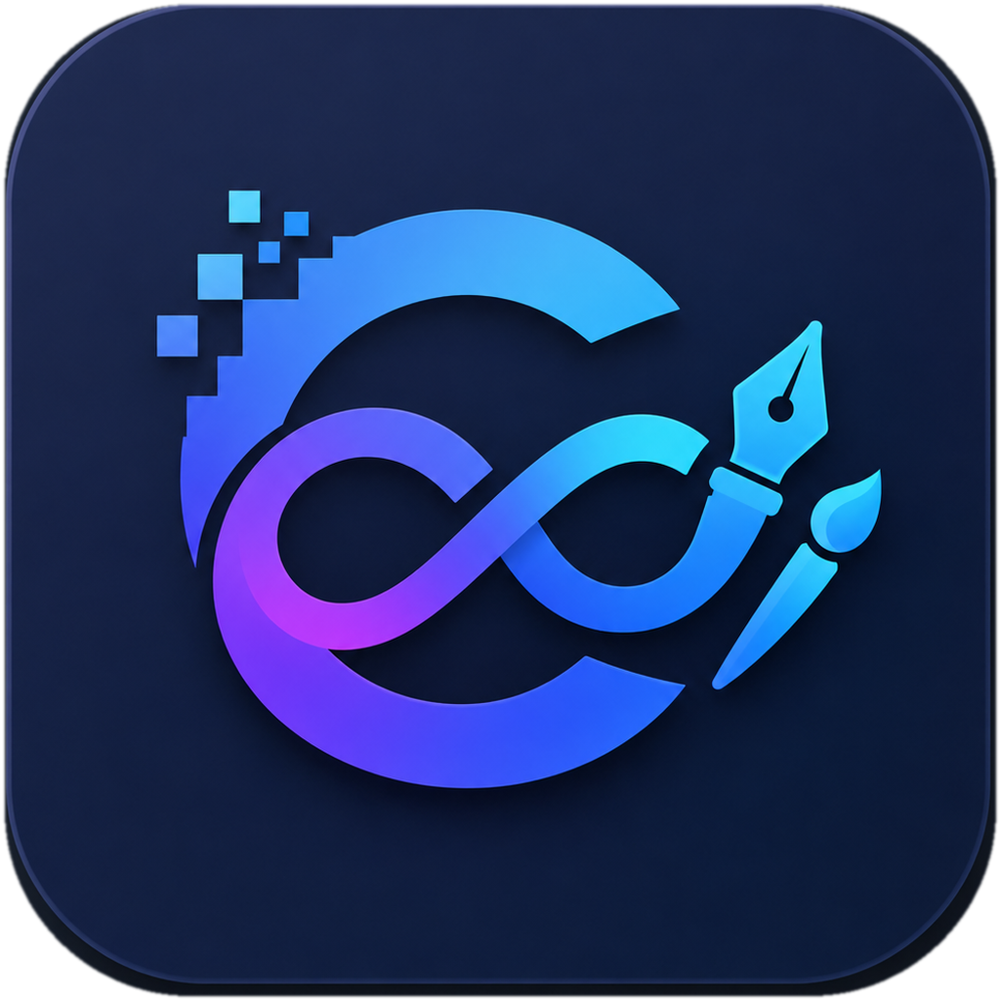
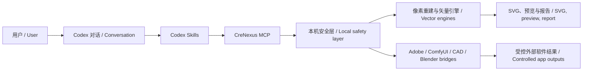

# 🤝 CreNexus 正在寻找合作伙伴 / Looking for Collaborators

CreNexus 正在寻找愿意一起把产品做完、测透并推向真实客户的开发者、设计师、测试人员、创意软件专家和商业合作伙伴。请联系：**[jianbaorui07@gmail.com](mailto:jianbaorui07@gmail.com)**。

> CreNexus is looking for developers, designers, QA engineers, creative-software specialists, and business partners who want to help finish, validate, and ship the product to real customers. Contact: **[jianbaorui07@gmail.com](mailto:jianbaorui07@gmail.com)**.

<p align="center">
  
</p>

# CreNexus：基于 Codex 的本地创意软件 / A Codex-Powered Local Creative App

[](https://github.com/jianbaorui07-dot/CreNexus/actions/workflows/ci.yml)


---

# 第一部分：先用大白话讲清楚 / Part I: The Plain-Language Overview

<h2 align="center">一张图片 → 像素重建 → SVG → 可选 AI / PSD</h2>
<p align="center"><strong>One image → Pixel Reconstruction → SVG → optional AI / PSD</strong></p>

## 把图片放进去，拿到真正可以交付的文件 / Put an Image In, Get a Deliverable File Out

CreNexus 不是一个只有按钮的演示页面。它把 **Codex 对话、本机任务执行、图片矢量化、结果核对、输出目录和 Adobe 文件交付** 放进同一个 Windows 桌面软件里。

> CreNexus is not a button-only demo. It brings **Codex conversation, local task execution, image vectorization, result verification, output management, and Adobe delivery** into one Windows desktop application.

你可以在软件里选择项目和图片，用自然语言告诉 Codex 想做什么，也可以直接操作页面。CreNexus 在本机执行任务，不把客户图片上传到 CreNexus 服务器。

> You can select a project and image, tell Codex what you want in natural language, or operate the workflow directly. CreNexus performs the work locally and does not upload customer images to a CreNexus server.

## 当前最主要的功能：像素重建 / Main Feature: Pixel Reconstruction

**像素重建**已经放进“图片矢量化”页面的四宫格模式区，并作为默认选项。它把选定工作分辨率中的每个 RGBA 像素重新画成真正的 SVG 几何，再把 SVG 渲染回来逐像素核对。

> **Pixel Reconstruction** is now a visible card in the four-mode Vectorization page and is selected by default. It redraws every RGBA pixel at the chosen working resolution as real SVG geometry, renders the SVG back, and verifies it pixel by pixel.

它不是把 PNG 塞进 SVG，也不调用 Illustrator Image Trace。生成结果没有嵌入位图、Base64 图片、脚本或外部链接。

> It does not hide a PNG inside an SVG, and it does not call Illustrator Image Trace. The generated result contains no embedded raster, Base64 image, script, or external link.

### 普通客户看到的流程 / What a Customer Sees

```text
Codex 对话或手动操作 / Codex chat or direct controls
→ 选择项目和图片 / Choose a project and image
→ 像素重建 / Pixel Reconstruction
→ 逐像素核对 / Pixel-by-pixel verification
→ 预览并打开输出文件夹 / Preview and open the output folder
→ 可选：选择新路径导出 AI 或 PSD / Optional: choose a new path for AI or PSD
```

桌面端可以选择 512、1024、1600、2048 或原始尺寸作为工作最长边；SVG 安全上限可以选择 64、128 或 256 MB，默认 128 MB。超过所选上限时任务会停止，不会覆盖原图，也不会偷偷降级成图像描摹。

> The desktop app lets the user choose 512, 1024, 1600, 2048, or the original size as the working longest edge. The SVG safety limit can be set to 64, 128, or 256 MB, with 128 MB as the default. If the selected limit is exceeded, the job stops without overwriting the source or silently falling back to Image Trace.

## 四种图片处理方式 / Four Image Modes

| 模式 / Mode | 大白话说明 / Plain-language description | 当前定位 / Current role |
| --- | --- | --- |
| **像素重建 / Pixel Reconstruction** (`exact`) | 尽量忠实地把工作分辨率的每个像素变成 SVG 几何 / Rebuild every working-resolution pixel as SVG geometry | **默认主推 / Default** |
| **匠心矢量 / Artisan Vector** | 用更少锚点和更顺的曲线做可编辑结果 / Create editable results with fewer anchors and smoother curves | 高级可编辑 / Advanced editing |
| **智能矢量 / Smart Vector** | 在相似度、细节和编辑性之间取平衡 / Balance similarity, detail, and editability | 通用插画 / General illustration |
| **轻量矢量 / Lightweight Vector** | 减少颜色、碎片和节点，让文件更轻 / Reduce colors, fragments, and nodes | Logo、图标和纹样 / Logos, icons, and patterns |

## AI、PSD 和保存路径 / AI, PSD, and Save Paths

“交付与证据”页面已经提供 **AI / PSD 格式选择、来源文件选择、明确确认和系统保存路径窗口**。Windows 上安装并授权对应 Adobe 软件后，CreNexus 会先在暂存区生成文件，再用 Adobe 原生程序重新打开验证，最后写入用户选择的新路径；已有文件不会被覆盖。

> The Delivery & Evidence page now provides **AI/PSD format selection, source selection, explicit confirmation, and a native save-path dialog**. On Windows, when the corresponding Adobe application is installed and licensed, CreNexus generates the file in staging, reopens it in the native Adobe application for validation, and only then writes it to the newly selected path. Existing files are never overwritten.

这条 Adobe 链路已经有实现和自动化测试，但不同 Photoshop、Illustrator 版本及不同客户机器的完整兼容矩阵仍处于实验验收阶段。

> The Adobe path is implemented and covered by automated tests, but the full compatibility matrix across Photoshop, Illustrator, and customer machines is still under experimental validation.

---

# 第二部分：技术、架构与专业边界 / Part II: Technology, Architecture, and Professional Boundaries

## Codex 在软件里负责什么 / What Codex Does

Codex 是理解和调度层：用户在“Codex 对话”页面提出目标，Codex 选择合适的 Skill 和 MCP 工具；CreNexus 本地运行时负责真正执行、限制路径、要求确认、验证结果并生成脱敏证据。

> Codex is the reasoning and orchestration layer. The user states a goal in the Codex Conversation page, Codex selects the appropriate Skill and MCP tool, and the CreNexus local runtime performs the actual work, constrains paths, requests confirmation, verifies results, and records redacted evidence.



## 像素重建的技术边界 / Pixel Reconstruction Boundaries

| 项目 / Item | 当前规则 / Current rule |
| --- | --- |
| 输入 / Input | 单张、明确授权的 PNG 或 JPEG；不扫描整个私有目录 / One explicitly authorized PNG or JPEG; no recursive private-directory scan |
| 重建 / Reconstruction | 连续同色像素合并为矩形复合路径，保留 RGBA / Merge continuous same-color pixels into compound rectangular paths while preserving RGBA |
| 工作尺寸 / Working size | 默认最长边 1024，可选 512 / 1600 / 2048 / 原始尺寸 / Default longest edge 1024; optional 512 / 1600 / 2048 / original |
| 安全上限 / Safety cap | 可选 64 / 128 / 256 MB，产品硬上限 256 MB / Selectable 64 / 128 / 256 MB; product hard cap 256 MB |
| 验证 / Verification | 复读尺寸、路径、颜色、透明度和像素差异 / Recheck dimensions, paths, colors, alpha, and pixel differences |
| 禁止内容 / Rejected content | 位图、Base64、脚本、外链、越界坐标 / Raster images, Base64, scripts, external links, out-of-bounds coordinates |
| 失败行为 / Failure behavior | 停止并报告，不覆盖源图，不回退 Image Trace / Stop and report; never overwrite the source or fall back to Image Trace |

像素重建强调“验证过的忠实结果”，不等于“少节点、好编辑”。如果客户要在 Illustrator 里继续改曲线，应选择匠心、智能或轻量矢量。

> Pixel Reconstruction optimizes for verified fidelity, not minimal nodes or easy curve editing. If the customer wants to edit curves in Illustrator, choose Artisan, Smart, or Lightweight Vector.

## Adobe 原生交付规则 / Native Adobe Delivery Rules

- SVG → AI：调用本机 Illustrator，保存后重新打开，检查画板和对象，再发布到用户选择的路径。

  > SVG → AI: invoke local Illustrator, save and reopen the file, verify artboards and objects, then publish it to the user-selected path.

- PNG/JPEG → PSD：调用本机 Photoshop，建立图层文档，保存后重新打开，检查画布和图层，再发布到用户选择的路径。

  > PNG/JPEG → PSD: invoke local Photoshop, create a layered document, save and reopen it, verify the canvas and layers, then publish it to the user-selected path.

- 两条路径都要求用户先勾选确认；取消路径选择不会产生文件；失败或超时会清理未完成文件。

  > Both paths require explicit confirmation. Cancelling the save dialog creates no file, and failed or timed-out exports clean up incomplete files.

- 当前原生 AI/PSD 导出只支持 Windows；macOS 会明确返回“不支持”，不会显示假成功。

  > Native AI/PSD export currently supports Windows only. macOS returns an explicit unsupported result instead of a false success.

## 本地优先与安全模型 / Local-First Safety Model

- 默认只读、计划或 `dry-run`；真实写入必须明确确认。

  > Read-only, planning, or `dry-run` by default; real writes require explicit confirmation.

- 输出限制在 safe roots、项目产物目录或用户明确选择的新路径。

  > Outputs are restricted to safe roots, project artifact directories, or a new path explicitly selected by the user.

- 报告保存哈希、相对引用和状态，不保存 Token、Cookie、OAuth、客户素材或绝对保存路径。

  > Reports store hashes, relative references, and status—not tokens, cookies, OAuth data, customer assets, or absolute save paths.

- Community 免费版无需登录或联网；当前源码版本采用 CreNexus 自有许可证。

  > Community is free and requires no login or network connection; the current source revision uses the CreNexus Proprietary License.

详细设计见 [产品事实](docs/PRODUCT_FACTS.md)、[架构 V2](docs/ARCHITECTURE_V2.md)、[四模式矢量化](docs/vectorization-modes.md)和[像素重建](docs/exact-pixel-vectorization.md)。

> See [Product Facts](docs/PRODUCT_FACTS.md), [Architecture V2](docs/ARCHITECTURE_V2.md), [Vectorization Modes](docs/vectorization-modes.md), and [Pixel Reconstruction](docs/exact-pixel-vectorization.md) for technical details.

## 开发者快速调用 / Developer Quick Call

```powershell
python -m pip install -e ".[vectorization]"
npm.cmd run illustrator:vectorize -- --input "<input.png>" --mode exact --max-dimension 1024 --max-svg-size-mb 128 --reference-id "reference"
```

可编辑矢量模式 / Editable vector modes:

```powershell
npm.cmd run illustrator:vectorize -- --input "<input.png>" --mode artisan --reference-id "reference"
npm.cmd run illustrator:vectorize -- --input "<input.png>" --mode smart --reference-id "reference"
npm.cmd run illustrator:vectorize -- --input "<input.png>" --mode lightweight --reference-id "reference"
```

---

# 第三部分：迭代数据、已完成与未完成 / Part III: Iteration Data, Completed Work, and Open Work

## 当前版本 / Current Version

当前公开版本为 **v0.1.0-alpha.2**。Community 开放核心免费且无需激活；桌面产品、安装器和第三方软件写入仍按各自证据等级标记为 stable、experimental 或 planned，不能把“代码存在”写成“所有客户机器都已验收”。

> The current public version is **v0.1.0-alpha.2**. The Community open core is free and requires no activation. The desktop product, installer, and third-party write paths remain labeled stable, experimental, or planned according to their evidence level; code existence must not be presented as acceptance on every customer machine.

## 小规模实测数据 / Small-Scope Measured Results

这些数字只代表已记录样例，不代表所有图片都能得到相同结果。

> These numbers describe recorded samples only and do not promise identical results for every image.

| 样例或迭代 / Sample or iteration | 指标 / Metric | 结果 / Result |
| --- | --- | ---: |
| 中央红鲤像素重建 / Central red-carp reconstruction | 输出尺寸 / Output size | 384 × 512 |
| 中央红鲤像素重建 / Central red-carp reconstruction | SVG 大小 / SVG size | 8,277,677 bytes |
| 中央红鲤像素重建 / Central red-carp reconstruction | 耗时 / Runtime | 1.47 s |
| 中央红鲤像素重建 / Central red-carp reconstruction | 差异像素 / Different pixels | 0 |
| 中央红鲤像素重建 / Central red-carp reconstruction | 最大通道差异 / Maximum channel difference | 0 |
| 中央红鲤像素重建 / Central red-carp reconstruction | 嵌入位图 / Embedded rasters | 0 |
| 匠心 Iteration 4 → 5 / Artisan Iteration 4 → 5 | 中心线锚点 / Centerline anchors | 30,813 → 24,875 (-19.27%) |
| 匠心 Iteration 4 → 5 / Artisan Iteration 4 → 5 | 子路径 / Subpaths | 10,309 → 8,064 (-21.78%) |
| 匠心 Iteration 4 → 5 / Artisan Iteration 4 → 5 | SVG 大小 / SVG size | 1,014,783 → 861,890 bytes (-15.07%) |

## 已经跑通或已有明确证据 / Completed or Evidence-Backed

| 能力 / Capability | 当前结论 / Current conclusion |
| --- | --- |
| Windows 桌面启动 / Windows desktop startup | 已有本机启动、关闭、二次启动和 sidecar 生命周期证据；整体仍标记 experimental / Local startup, shutdown, relaunch, and sidecar lifecycle are evidenced; overall status remains experimental |
| Codex 对话与 MCP / Codex conversation and MCP | 对话入口、连接状态、安全工具注册和项目级 `.codex/config.toml` 已实现 / Conversation entry, connection state, safe tool registry, and project-level `.codex/config.toml` are implemented |
| 图片矢量化 / Image vectorization | 四种引擎已实现；像素重建已成为桌面默认入口 / Four engines are implemented; Pixel Reconstruction is the desktop default |
| 客户主流程 / Customer main flow | 选择项目与图片 → 像素重建 → 核对 → 预览 → 打开输出目录已接通 / Project and image selection → reconstruction → verification → preview → output folder is connected |
| AI/PSD 交付界面 / AI/PSD delivery UI | 格式、来源、确认、路径选择、历史回执和不覆盖规则已实现 / Format, source, confirmation, path picker, receipt history, and no-overwrite rules are implemented |
| 自动化验证 / Automated validation | 功能开发基线曾通过 836 个 Python 测试、34 个前端测试和 27 个 Rust 测试；CI 继续作为每次合并的实际准线 / The feature baseline passed 836 Python, 34 frontend, and 27 Rust tests; CI remains the per-merge source of truth |

## 还没有完全跑通 / Not Fully Completed Yet

| 项目 / Area | 还缺什么 / What remains |
| --- | --- |
| 正式 Windows 发布 / Production Windows release | Authenticode 签名、SmartScreen、干净机器矩阵、正式更新签名 / Authenticode signing, SmartScreen validation, clean-machine matrix, production updater signing |
| Adobe 全版本兼容 / Full Adobe compatibility | 多版本 Photoshop/Illustrator、多语言安装、异常恢复和更多真实客户机器验收 / Multiple Photoshop/Illustrator versions, localized installs, recovery cases, and more customer-machine acceptance |
| macOS 桌面端 / macOS desktop | Darwin sidecar、Tauri 桌面启动、macOS CI、原生 Adobe 导出 / Darwin sidecar, Tauri desktop startup, macOS CI, native Adobe export |
| ComfyUI 生产闭环 / ComfyUI production loop | 更多真实安装方式、自定义节点、模型环境和失败恢复验收 / More real installations, custom nodes, model environments, and failure-recovery acceptance |
| Blender、AutoCAD、剪映 / Blender, AutoCAD, CapCut | 目前以探针、计划、dry-run 或实验能力为主，尚未形成统一客户级闭环 / Currently probe, plan, dry-run, or experimental capabilities; no unified customer-grade loop yet |
| 商业发布 / Commercial launch | 正式安装包、更新通道、隐私与售后流程、Pro 能力交付 / Signed installer, update channel, privacy/support processes, and Pro delivery |

因此，当前最准确的说法是：**Windows 本地软件和像素重建主链路已经跑通到可继续客户验收的阶段；完整商业版、macOS 和所有第三方创意软件的广泛兼容仍未跑通。**

> The most accurate statement today is: **the Windows local application and the Pixel Reconstruction main path are working well enough for continued customer acceptance testing; a full commercial release, macOS desktop support, and broad compatibility across all third-party creative tools are not finished yet.**

---

# 第四部分：Windows / macOS 配置与 Codex 快速安装 / Part IV: Windows / macOS Setup and Fast Codex Installation

## Windows：完整桌面能力优先 / Windows: Full Desktop Path

### 最少准备 / Minimum prerequisites

- Git 64 位、Python 3.10+。要运行桌面端，再安装 Node.js 22 LTS、Rust stable MSVC、Microsoft C++ Build Tools 和 WebView2。

  > Install Git 64-bit and Python 3.10+. For the desktop app, also install Node.js 22 LTS, Rust stable MSVC, Microsoft C++ Build Tools, and WebView2.

### 让 Codex 一次完成核心环境 / Let Codex Prepare the Core Environment

把下面这段直接发给 Codex / Paste this directly into Codex:

```text
请克隆 https://github.com/jianbaorui07-dot/CreNexus.git，进入仓库后运行
powershell -ExecutionPolicy Bypass -File .\bootstrap.ps1 -Profile auto
不要修改系统级软件；完成后运行安全预检，并告诉我 .codex/config.toml 是否生成成功。

Clone https://github.com/jianbaorui07-dot/CreNexus.git, enter the repository, run
powershell -ExecutionPolicy Bypass -File .\bootstrap.ps1 -Profile auto
Do not modify system-level software. Then run the safe preflight and report whether .codex/config.toml was created successfully.
```

手动执行 / Manual equivalent:

```powershell
git clone https://github.com/jianbaorui07-dot/CreNexus.git
Set-Location .\CreNexus
powershell -ExecutionPolicy Bypass -File .\bootstrap.ps1 -Profile auto
```

`bootstrap.ps1` 会创建仓库内 `.venv`、安装匹配的 Python/MCP 依赖、生成项目级 `.codex/config.toml` 并运行安全检查。完成后，在这个仓库里新建一个 Codex 任务，让 Codex 重新载入 MCP 配置。

> `bootstrap.ps1` creates a repository-local `.venv`, installs matching Python/MCP dependencies, writes project-level `.codex/config.toml`, and runs safe checks. When it finishes, open a new Codex task in this repository so Codex reloads the MCP configuration.

### 启动 Windows 桌面端 / Start the Windows Desktop App

```powershell
npm.cmd ci --prefix apps\starbridge-desktop
powershell -ExecutionPolicy Bypass -File apps\starbridge-desktop\scripts\Build-Sidecar.ps1
npm.cmd run tauri:dev --prefix apps\starbridge-desktop
```

只想先验证核心时，运行 / To verify the core first:

```powershell
.\.venv\Scripts\python.exe scripts\starbridge_preflight.py --markdown
.\.venv\Scripts\python.exe -m starbridge_mcp.server tools --json --safe-only
```

## macOS：先跑核心 MCP，不承诺桌面壳 / macOS: Core MCP First, Desktop Not Yet Promised

### 最少准备 / Minimum prerequisites

- Git、Python 3.10+。Node.js 只在需要前端构建或可选桥接时使用。

  > Install Git and Python 3.10+. Node.js is only needed for frontend builds or optional bridges.

### 让 Codex 一次完成安全核心 / Let Codex Prepare the Safe Core

把下面这段直接发给 Codex / Paste this directly into Codex:

```text
请克隆 https://github.com/jianbaorui07-dot/CreNexus.git，进入仓库后运行
bash ./bootstrap.sh --profile auto
不要安装或修改 Homebrew、Xcode、Rosetta 或系统级软件；完成后运行安全预检，并告诉我 .codex/config.toml 是否生成成功。

Clone https://github.com/jianbaorui07-dot/CreNexus.git, enter the repository, run
bash ./bootstrap.sh --profile auto
Do not install or modify Homebrew, Xcode, Rosetta, or system-level software. Then run the safe preflight and report whether .codex/config.toml was created successfully.
```

手动执行 / Manual equivalent:

```bash
git clone https://github.com/jianbaorui07-dot/CreNexus.git
cd CreNexus
bash ./bootstrap.sh --profile auto
```

`bootstrap.sh` 会创建 `.venv`、安装安全 Python/MCP 路径、写入项目级 Codex MCP 配置并运行检查；它不会安装 Homebrew、Xcode、Rosetta，也不会启动 Tauri 桌面端。完成后同样需要在仓库中打开新的 Codex 任务。

> `bootstrap.sh` creates `.venv`, installs the safe Python/MCP path, writes the project-level Codex MCP configuration, and runs checks. It does not install Homebrew, Xcode, or Rosetta and does not start Tauri. Open a new Codex task in the repository afterward.

验证 macOS 核心 / Verify the macOS core:

```bash
./.venv/bin/python scripts/starbridge_preflight.py --markdown
./.venv/bin/python -m starbridge_mcp.server tools --json --safe-only
```

前端代码可以单独构建，但当前不要把它当成可运行的 macOS 桌面版 / The frontend can be built separately, but this is not a working macOS desktop release:

```bash
npm ci --prefix apps/starbridge-desktop
npm run build --prefix apps/starbridge-desktop
```

## 配置失败时先检查 / First Checks When Setup Fails

| 检查 / Check | Windows | macOS |
| --- | --- | --- |
| Python | `python --version` | `python3 --version` |
| Git | `git --version` | `git --version` |
| Node（桌面/前端）/ Node (desktop/frontend) | `node --version` | `node --version` |
| Codex 项目配置 / Codex project config | `.codex\config.toml` | `.codex/config.toml` |
| 安全预检 / Safe preflight | `.\.venv\Scripts\python.exe scripts\starbridge_preflight.py --markdown` | `./.venv/bin/python scripts/starbridge_preflight.py --markdown` |

不要把 Token、Cookie、Adobe 授权信息、客户素材或真实保存路径提交到 GitHub。

> Never commit tokens, cookies, Adobe licensing information, customer assets, or real save paths to GitHub.

---

## 仓库导航 / Repository Map

| 路径 / Path | 用途 / Purpose |
| --- | --- |
| `.codex/skills/starbridge-*` | Codex Skills、安全边界和验证命令 / Codex Skills, safety boundaries, and verification commands |
| `starbridge_mcp/` | MCP server、工具注册和安全层 / MCP server, tool registry, and safety layer |
| `apps/starbridge-desktop/` | Tauri 2 + React 桌面端 / Tauri 2 + React desktop app |
| `product/` | 机器可读产品事实 / Machine-readable product facts |
| `examples/` | 默认安全的桥接示例 / Safe-by-default bridge examples |
| `tests/` | 离线、集成和安全测试 / Offline, integration, and safety tests |
| `docs/` | 架构、接入协议和能力边界 / Architecture, integration protocols, and capability boundaries |

## 贡献与许可证 / Contributing and License

提交代码前请阅读 [CONTRIBUTING.md](CONTRIBUTING.md) 和 [SECURITY.md](SECURITY.md)。当前版本采用 [CreNexus 自有许可证](LICENSE)：Copyright © 2025–2026 菅宝瑞，保留所有权利；在适用法律允许的范围内，相关授权条款的最终解释权归菅宝瑞所有。历史版本仍适用其发布时随附的许可证。

> Read [CONTRIBUTING.md](CONTRIBUTING.md) and [SECURITY.md](SECURITY.md) before contributing. The current revision is released under the [CreNexus Proprietary License](LICENSE). Earlier revisions remain subject to the license terms distributed with those revisions.
