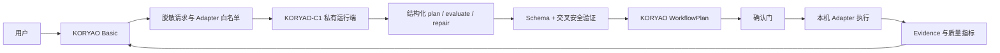

# KORYAO 闭源模型架构与公共协议边界

状态：`koryao-model-contract/v1` 公共协议已定义；真实模型运行端、训练端、数据与权重不在本仓库。

## 目标

KORYAO-C1 是创意工作流控制模型，不直接操作客户文件。它只负责：

- 理解已经脱敏的用户意图；
- 从 KORYAO 明确提供的 Adapter / action 白名单中选择能力；
- 返回结构化工作流计划；
- 根据结构化 Evidence 和质量指标给出评估；
- 在失败后给出受约束的修复计划。

KORYAO Basic 继续负责 Project、CreativeJob、Workflow Engine、Adapter、safe roots、确认门、真实文件读写、软件调用、结果验证和脱敏 Evidence。



## 仓库责任

| 仓库 | 可以包含 | 不能包含 |
| --- | --- | --- |
| `KORYAO-basic` | 公共协议、JSON Schema、抽象 Provider/Client 接口、安全验证、Workflow/Adapter 接入、测试 | 真实模型实现、训练代码、私有 prompt、训练数据、权重、生产密钥 |
| `KORYAO-Model-Private` | 私有运行端、Provider 实现、规则 Planner、模型注册、训练与评测代码 | 客户原始资产的普通 Git 历史、生产签名私钥 |
| `KORYAO-Data-Private` | 数据清单、授权证明索引、标签、评测集、数据校验脚本 | 未授权素材、客户资产默认副本、大型原始文件、凭据 |
| 加密模型/对象存储 | 权重、受控数据包、不可放 Git 的大型产物 | 未登记来源或未批准训练权利的数据 |

当前公开源码修订采用 KORYAO Proprietary License。历史版本随附的既有许可证权利不追溯撤销。公开可见不等于当前修订采用 MIT。

## 公共协议

协议版本固定为：

```text
koryao-model-contract/v1
```

协议文件位于 `model_contracts/schemas/`：

- `plan_request.schema.json`
- `plan_response.schema.json`
- `evaluate_request.schema.json`
- `evaluate_response.schema.json`
- `repair_request.schema.json`
- `repair_response.schema.json`
- `model_status.schema.json`

公共 Python 包同时提供：

- `model_contracts.client.ModelContractClient`
- `model_contracts.provider_interface.BaseModelProvider`
- `model_contracts.validate_plan_response`
- `model_contracts.ensure_plan_response`

这些只是接口与安全边界，不包含任何私有推理逻辑。

## 计划请求

KORYAO 只向模型发送：

- `requestId`、`projectId` 等安全 ID；
- 用户指令；
- 资产 ID、媒体类型和 SHA-256 等不含路径的引用；
- 当前允许的 Adapter / action 白名单；
- 本地/云模式、输出格式、步数、safe-root 引用等约束；
- 明确的隐私声明。

不得发送：

- 绝对路径、客户文件名或递归目录结果；
- Token、Cookie、OAuth 缓存、账号或付款信息；
- 任意 Python、PowerShell、shell 或可执行文件；
- 未经用户确认的原始素材内容；
- KORYAO 的生产授权或更新签名私钥。

## 计划响应

模型响应只能包含：

- 模型与 Provider 标识；
- 工作流 ID、置信度和摘要；
- Adapter / action 白名单内的结构化步骤；
- 输入引用、有限标量参数、依赖关系和 safe-root 引用；
- 是否需要确认；
- 质量目标；
- 明确的安全声明。

模型响应不能包含 `command`、`script`、`code`、`shell`、`executable`、文件路径或 URL。即使 JSON Schema 通过，KORYAO 仍必须执行请求/响应交叉验证，拒绝：

- 未在请求白名单中的 Adapter 或 action；
- 删除确认门的写入步骤；
- 越过 `maxSteps` 的计划；
- 未声明的 safe root；
- 重复、未知或循环步骤依赖；
- 绝对路径、命令片段、URI 或路径遍历；
- 不匹配的 `requestId` 或协议版本。

模型响应不能直接成为可执行命令。KORYAO 重新构造自己的 `WorkflowPlan`、计算 `planHash`，再交给既有 Workflow Engine。

## 本地运行端

第一版本地运行端必须：

- 只绑定 `127.0.0.1` 或 `::1`；
- 默认禁止外网；
- 不直接扫描或读取用户磁盘；
- 不记录完整指令、绝对路径、客户文件名或原始素材；
- 实现 `GET /v1/health`、`GET /v1/models`；
- 实现 `POST /v1/plan`、`POST /v1/evaluate`、`POST /v1/repair`；
- 对所有请求和响应执行 `koryao-model-contract/v1` 验证；
- 结构化日志只记录请求 ID、模型版本、意图类别、耗时、状态和错误码。

## 未来云模型

当前 KORYAO 产品数据政策仍是 local-only，云模型属于未实现能力。未来如果增加云端：

| 项目 | 本地模型 | 未来云模型 |
| --- | --- | --- |
| 默认状态 | 可用时本机选择 | 默认关闭 |
| 网络 | loopback | 用户显式启用的固定服务 |
| 素材传输 | 默认无原始素材传输 | 每次明确同意，范围可见 |
| 合同字段 | `executionMode=local` | `executionMode=cloud` |
| `cloudProcessingApproved` | 必须为 `false` | 必须为 `true` |
| `materialTransfer` | `none` 或 `metadata_only` | `metadata_only` 或 `user_approved_assets` |
| 文件执行 | 始终由 KORYAO Adapter 完成 | 始终由 KORYAO Adapter 完成 |

仅切换 URL 不能把本地模式变成云模式。桌面端必须单独显示数据范围、服务方、保留策略和用户确认。

## Community / Basic 构建边界

KORYAO Basic 的干净 checkout 必须在没有私有仓库凭据时完整构建和测试。构建图不得包含：

- 私有 Provider 实现；
- 模型权重、LoRA、VAE 或 checkpoint；
- 训练/微调代码；
- 私有 prompt；
- 离线签发器或生产私钥；
- 仅靠 UI 隐藏的完整 Pro/模型逻辑。

公共协议可以被私有运行端固定引用；私有运行端不能反向把实现复制进 Basic 构建。

## 端到端安全门

1. KORYAO 导入用户明确选择的资产并生成不含路径的引用。
2. KORYAO 根据已注册能力生成 Adapter / action 白名单。
3. 模型请求先过 JSON Schema。
4. 模型响应先过 JSON Schema。
5. 请求/响应再做交叉验证和危险内容扫描。
6. KORYAO 构造并持久化自己的 `WorkflowPlan` 和 `planHash`。
7. Workflow Engine 运行 `probe → plan → validate`。
8. 任意受控写入必须经过既有确认门。
9. Adapter 执行、回滚、收集 Artifact 与 Evidence。
10. 评估与修复建议仍需重复相同安全门，不能绕过确认。

任何一步失败都应 fail closed，并返回结构化错误；不得自动降级成任意命令执行。
