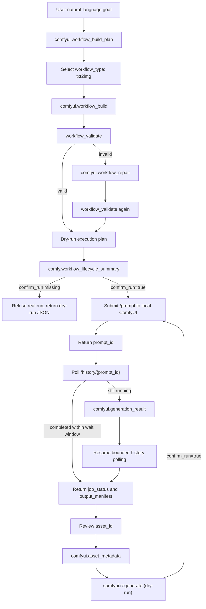

# ComfyUI Agent Workflow Protocol

This protocol describes the MVP path where an AI agent turns a natural-language goal into a ComfyUI API workflow, validates and repairs it, then submits it only after explicit confirmation.



## Tools

| Tool | Mode | Purpose | External side effect |
| --- | --- | --- | --- |
| `comfyui.workflow_build_plan` | dry-run | Converts a goal into a workflow construction plan. | None |
| `comfyui.workflow_build` | dry-run | Builds API-format workflow JSON and returns a workflow hash. | None |
| `comfyui.workflow_repair` | dry-run | Repairs missing nodes, bad numeric parameters, invalid dimensions, and core links. | None |
| `comfy.workflow_lifecycle_summary` | safe read-only | Returns redacted job / asset lifecycle, submit gate, and evidence preview for a reviewed workflow. | None |
| `comfyui.agent_run` | dry-run by default; confirmed run with `confirm_run=true` | Runs build, validate, repair, submit, status, manifest. | Contacts local ComfyUI and may cause ComfyUI to write images to its own output folder |
| `comfyui.generation_result` | live read-only | Resumes bounded polling for one explicit prompt ID and returns terminal state plus a stable-ID, basename-only output manifest. | Sends loopback-only `GET /history/{prompt_id}` requests; never submits or reads image bytes |
| `comfyui.asset_metadata` | session read-only | Checks whether one stable `asset_id` still has usable in-memory provenance and reports its remaining TTL plus supported regeneration overrides. | None; never contacts ComfyUI or reads files |
| `comfyui.regenerate` | dry-run by default; confirmed run with `confirm_run=true` | Replays the in-memory workflow provenance for one `asset_id` with bounded parameter overrides. | Confirmed mode submits a new loopback ComfyUI job; provenance is never persisted |

## Build Plan Contract

Input:

```json
{
  "goal": "生成一张国风 Q版 明代街市人物场景图",
  "workflow_type": "txt2img",
  "style": "Q版3D半动漫国风",
  "width": 1344,
  "height": 768
}
```

Output highlights:

```json
{
  "ok": true,
  "mode": "dry_run",
  "workflow_type": "txt2img",
  "required_nodes": [
    "CheckpointLoaderSimple",
    "CLIPTextEncode_positive",
    "CLIPTextEncode_negative",
    "EmptyLatentImage",
    "KSampler",
    "VAEDecode",
    "SaveImage"
  ],
  "will_build": false,
  "will_submit": false
}
```

## Build Contract

`comfyui.workflow_build` must:

- Generate ComfyUI API-format JSON, not visual workflow JSON.
- Avoid scanning disk or reading model folders.
- Use a provided checkpoint value or a placeholder.
- Generate a `workflow_hash`.
- Return `node_summary` with class counts and output node IDs.
- Return `validation` metadata from the same validator used by `comfyui.workflow_validate`.

## Repair Contract

`comfyui.workflow_repair` must repair the txt2img core:

- Missing positive prompt.
- Missing negative prompt.
- Missing sampler node.
- Missing latent image node.
- Missing save image node.
- Bad `steps`, `cfg`, or `seed` types.
- Invalid `width` or `height`.
- Broken links between checkpoint, CLIP encoders, sampler, latent image, VAE decode, and save image.

## Run Contract

`comfy.workflow_lifecycle_summary` must not return raw workflow JSON, prompt text, model names, input paths, or generated image filenames. It may return node counts, workflow hash, asset roles, confirmation state, and an evidence manifest preview.

`comfyui.agent_run` must refuse real submission unless:

```json
{
  "confirm_run": true
}
```

Without confirmation, it returns:

```json
{
  "mode": "dry_run",
  "submitted": false,
  "prompt_id": null,
  "job_status": {
    "state": "not_submitted"
  }
}
```

With confirmation, it may call:

- `POST /prompt`
- `GET /history/{prompt_id}`

The returned `output_manifest` is sanitized and contains only ComfyUI output metadata such as `filename`, `subfolder`, `type`, and `node_id`. It must not include absolute local paths.

### 终态与失败恢复契约

`POST /prompt` 返回 `prompt_id` 只表示 ComfyUI 已接受提交，不等于已经生成成功。轮询到对应 history 后，`comfyui.agent_run` 必须继续读取脱敏后的终态信号：

| ComfyUI history 信号 | `job_status.state` | `ok` | `submitted` |
| --- | --- | --- | --- |
| `status.status_str=success` 或 `execution_success` | `completed` | `true` | `true` |
| `status.status_str=error` 或 `execution_error` | `failed` | `false` | `true` |
| `execution_interrupted` | `cancelled` | `false` | `true` |
| 已取得 `prompt_id`，但 history 查询失败或缺少可验证终态 | `status_unavailable` | `false` | `true` |
| 等待窗口结束但任务尚未进入 history | `submitted` 或 `queued_or_running` | `false` | `true` |

history 中出现任务记录本身不能作为成功证据；只有规范化终态为 `completed` 时才允许 `ok=true`。失败或取消后必须立即停止轮询，不得继续等待到超时，也不得把已经成功入队的任务改写成 `submitted=false`。任务仍在排队或运行时，必须保留同一个 `prompt_id` 继续监控，不能自动重复提交。

失败响应只允许返回标准化状态、`terminal_event`、脱敏产物清单和通用恢复建议。不得返回 ComfyUI 的异常正文、traceback、模型名、prompt、workflow 或本机路径。恢复建议应要求调用方先在本机检查失败节点或中断原因，再重新 review dry-run；再次提交仍需显式 `confirm_run=true`。

如果提交后的 history 查询断线或缺少可验证终态，必须保留 `prompt_id` 和 `submitted=true`，并返回 `status_unavailable`。调用方应先用同一个 `prompt_id` 恢复查询，确认本机 queue/history 后再决定是否重试，避免重复生成。

实现依据：ComfyUI 官方执行器把 `execution_success`、`execution_error` 与 `execution_interrupted` 写入 history 状态消息；官方 jobs 归一化逻辑先读取 `status_str`，再在 error 状态下用 `execution_interrupted` 区分 `cancelled` 与 `failed`。CreNexus 对缺少可验证终态的旧 payload 有意采用更保守的 `status_unavailable`，避免仅凭 history 存在就宣称成功。

- [ComfyUI `execution.py` 终态事件](https://github.com/Comfy-Org/ComfyUI/blob/0aecac867d7840b56ad790aa76c5e76e33c74c3d/execution.py#L674-L820)
- [ComfyUI `comfy_execution/jobs.py` 状态归一化](https://github.com/Comfy-Org/ComfyUI/blob/0aecac867d7840b56ad790aa76c5e76e33c74c3d/comfy_execution/jobs.py#L191-L243)

If the confirmed run returns `queued_or_running`, call `comfyui.generation_result` with the returned `prompt_id`. The result tool:

- accepts only a bounded URL-safe prompt ID;
- accepts only a plain loopback HTTP ComfyUI URL;
- polls for at most 60 seconds and follows no redirects;
- hashes the prompt ID in its response;
- gives every output a deterministic `asset_id` derived from its job/output identity, so a caller can refer to the same result without retaining a private path;
- reduces every output filename and subfolder to a basename and never returns workflow, prompt, model, image bytes, traceback, or absolute paths;
- distinguishes `queued_or_running`, `completed`, `completed_no_outputs`, `failed`, `cancelled`, and `status_unavailable`.

`asset_id` is a logical identity, not a filesystem path or download URL. It is stable for the same prompt/output tuple and changes when the prompt ID, output node, filename, subfolder, type, or output position changes. The guarded `comfyui.regenerate` tool resolves this identity only against an in-memory provenance record; this protocol does not persist private workflow data to Git.

## Asset Metadata Contract

Call `comfyui.asset_metadata` before regeneration to check whether the current server session can still resolve an asset:

```json
{
  "asset_id": "asset_0123456789abcdef"
}
```

The read-only response contains only `available`, `can_regenerate`, `workflow_hash`, remaining provenance TTL, and a fixed list of supported override field names. It never returns the stored workflow, prompts, node parameters, model names, filenames, image bytes, or local paths. Unknown, expired, or post-restart asset IDs return `asset_provenance_unavailable`; the tool never scans ComfyUI history or the filesystem to reconstruct provenance.

## Regenerate Contract

`comfyui.regenerate` closes the first generate → result → iterate loop. The server keeps a maximum of 128 in-memory provenance records for 24 hours. Records are created only for jobs submitted by the current `comfyui.agent_run` / `comfyui.regenerate` process and disappear on restart.

The tool accepts a returned `asset_id` plus optional `prompt`, `negative_prompt`, `seed`, `steps`, `cfg`, `sampler`, `scheduler`, `width`, and `height` overrides. It returns only the names of applied override fields, validation counts, workflow hash, job state, and sanitized output metadata. It never returns the stored workflow or prompt text.

Without confirmation it validates the regenerated workflow but does not submit it:

```json
{
  "asset_id": "asset_0123456789abcdef",
  "prompt": "refine the lighting",
  "steps": 28,
  "confirm_run": false
}
```

Real replay requires a second explicit gate:

```json
{
  "asset_id": "asset_0123456789abcdef",
  "prompt": "refine the lighting",
  "confirm_run": true
}
```

Unknown, expired, or post-restart asset IDs return `asset_provenance_unavailable`; the tool never guesses a local path or scans ComfyUI history to reconstruct private provenance.

## Safety Rules

- Default path is dry-run.
- No hardcoded local model path.
- No private output path in MCP results.
- No filesystem scan for checkpoints.
- Confirmed run requires local ComfyUI to be running.
- Current MVP supports `txt2img`; ControlNet, LoRA, img2img, inpaint, and upscale remain next-stage work.
