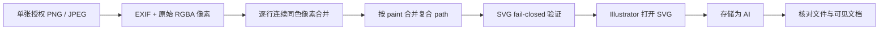

# 精确像素矢量重建：默认图片转 AI 工作流

这是 StarBridge 当前主推的图片转矢量能力。普通图片转矢量任务默认且只选择这条路线：**不调用 Illustrator Image Trace，不嵌入原始位图，也不把量化预览冒充原图**。

## 方法

1. 只读取用户本次明确授权的一张 PNG 或 JPEG，不扫描目录。
2. 应用 EXIF 方向并转换为 RGBA 像素网格，不缩放、不模糊、不量化颜色。
3. 从左到右扫描每一行，把连续的相同 RGBA 像素合并成一个矩形子路径。
4. 按 RGBA paint 把矩形合并到少量复合 SVG `<path>` 对象中。
5. 用 fail-closed verifier 检查尺寸、路径、颜色、透明度、字节数和 SHA-256，并拒绝 `<image>`、脚本、外链和越界坐标。
6. 在 Illustrator 中打开已验证 SVG，使用“存储为 Adobe Illustrator (`.ai`)”；不执行“图像描摹”。
7. 大型文件写入期间检查 Illustrator 进程仍在响应；完成后复核桌面 `.ai` 文件存在、大小非零，并保持文档可见。



## 命令

```powershell
python -m pip install -e ".[illustrator-vector]"
npm.cmd run illustrator:vectorize:offline -- --input "<input.jpg>" --reference-id "reference"
```

默认输出位于被 Git 忽略的：

```text
examples/output/illustrator/exact-pixel/<reference-id>/
  exact_pixel_vector.svg
  exact_pixel_vector.report.json
```

桌面 `.ai` 交付只在用户明确要求时执行。源图、SVG、AI 和 report 都不能提交到 GitHub。

## 已完成的本机写入摘要

2026-07-15 的一次授权本机运行使用了以下脱敏证据：

| 项目 | 结果 |
| --- | ---: |
| 源画布 | 736 × 1314 |
| 源像素 | 967,104 |
| 实际 RGB paint | 260 |
| SVG path 对象 | 260 |
| 矩形子路径 | 742,922 |
| SVG 大小 | 31,168,231 bytes |
| AI 大小 | 14,117,224 bytes |
| Illustrator Image Trace | 未使用 |
| 嵌入位图 | 0 |

Illustrator 保存高复杂度 AI 时会持续占用 CPU 和内存。只要进程仍响应、CPU 时间继续增加，就应等待写入完成；不要因为数十秒内文件尚未出现而中断。该次运行最终成功生成桌面 AI。

## “精确”的边界

- 精确指源图像素网格中的 RGBA 值与位置被确定性地重建为矩形矢量几何。
- 它不是语义曲线重绘；高倍放大会看到原图本身的像素边界。
- 复杂照片可能产生数十万到数百万子路径，SVG / AI 会很大，Illustrator 保存需要较长时间。
- 当前安全上限是 4,000,000 像素、2,000,000 个矩形子路径和 verifier 的 64 MiB SVG 限制。
- 超过上限时必须停止并让用户决定缩小图片或调整交付目标，不能自动回退到 Image Trace。

## 其他能力仍然保留

StarBridge 仍保留 Photoshop 安全预处理、Illustrator plan / validate / compare 协议、旧量化 SVG 实验、ComfyUI、CAD / AutoCAD、Blender、CapCut / 剪映、UXP / Node Proxy 和 MCP stdio 能力。它们继续出现在能力矩阵中，但普通“图片转矢量 / 转 AI”请求的默认入口是本页的精确像素矢量重建。
