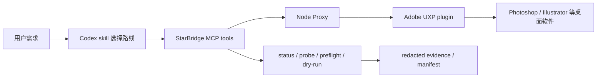

# Skill / MCP / UXP 总体定位

本仓库的长期方向不是堆更多零散 demo，而是服务三层公开协作：

1. **Skill 层**：让 Codex 知道面对 Photoshop、Illustrator、CAD、Blender 等任务时该读哪些文件、运行哪些命令、避开什么风险。
2. **MCP 层**：把已经收敛的安全能力暴露成结构化 `tools/list` / `tools/call`，供 Codex、Cursor、Claude Code 等 MCP 客户端调用。
3. **UXP / 本地代理层**：为 Adobe 桌面软件提供可审计的插件和本地代理通道，先服务 Photoshop UXP v2 + Node Proxy，再逐步评估 Illustrator 等其它 Adobe 软件。

## 目录分工

| 目录 | 服务层 | 只保留什么 |
| --- | --- | --- |
| `.codex/skills/` | Skill | Codex skill 说明、路由、验证命令和安全边界 |
| `starbridge_mcp/` | MCP | stdio server、tool registry、adapter、schema、安全层 |
| `uxp/` | UXP | Adobe UXP 插件原型、typed handler、连接本地代理的公开代码 |
| `node_proxy/` | UXP / MCP bridge | 本地 JSON-RPC / WebSocket 代理，不保存账号或素材 |
| `docs/` | 三层共用 | 协议、路线图、中文索引、研究结论 |
| `examples/` | 三层共用 | 公开安全 probe、dry-run、sandbox 示例 |
| `tests/` | 三层共用 | schema、registry、安全边界、CI 可跑验证 |

## 三层调用关系

## 当前优先级

| 优先级 | 内容 |
| --- | --- |
| P0 | 维护 `starbridge-mcp` 总 skill 和 PS / AI / CAD / Blender 专用 skill |
| P0 | 保持 MCP safe-only registry、路径脱敏、安全扫描和 CI 稳定 |
| P1 | 把 Photoshop UXP v2 + Node Proxy 收敛成可审计的只读和确认写入链路 |
| P1 | 让 Adobe 相关写入统一走 recipe / plan / validate / confirm / evidence |
| P2 | 评估 Illustrator UXP 或脚本代理，但不接入任意 JSX 执行 |

## 不做的事

- 不把第三方 MCP 项目源码直接复制进公开实现。
- 不提交 PSD、AI、DWG、DXF、AEP、PRPROJ、INDD、`.blend`、照片库、模型、生成图或导出视频。
- 不保存 Adobe 登录状态、Creative Cloud 缓存、token、Cookie、OAuth、许可证或本机安装路径。
- 不在 CI 中启动 Photoshop、Illustrator、AutoCAD、Blender、ComfyUI、CapCut 或任何真实桌面软件。
- 不开放任意脚本执行工具；UXP 和 BatchPlay 只能走白名单动作、结构化参数和显式确认。
