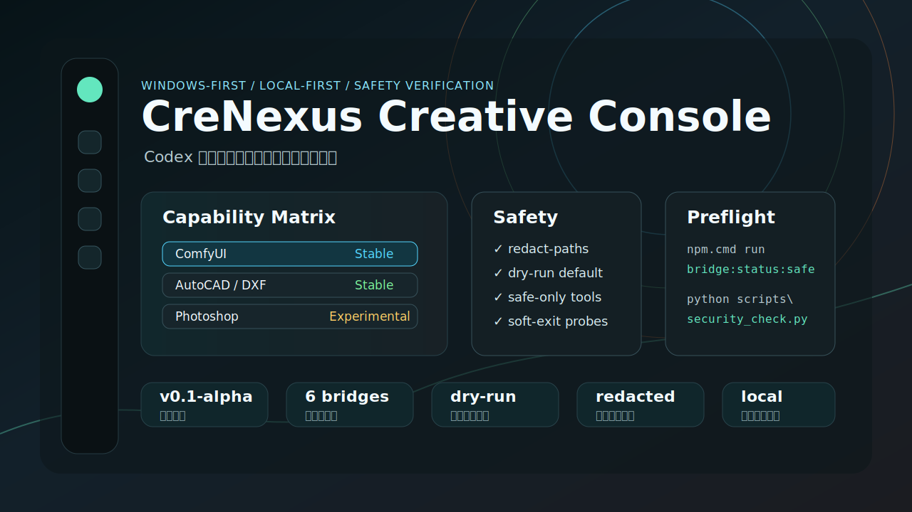

# 可视化 demo

StarBridge 现在提供两个公开安全的可视化入口：一个静态预览图和一个本地 React / Three.js 控制台。它们只展示能力矩阵、验证命令和安全边界，不包含真实 PSD、AI、DWG、模型、生成图、客户素材或本机路径。



## 静态预览

静态预览位于 [docs/assets/starbridge-console-preview.svg](assets/starbridge-console-preview.svg)，用于 GitHub README 和文档首页展示。它是手工维护的公开安全图，不是从本机软件截图导出。

## 本地交互控制台

交互控制台位于 [examples/starbridge_frontend/](../examples/starbridge_frontend/)，展示六条软件桥的状态、验证命令、风险边界和发布前检查。

本地运行：

```powershell
npm.cmd run frontend:dev
```

构建检查：

```powershell
npm.cmd run frontend:build
```

## 真实截图策略

真实 Photoshop、Illustrator、CAD、ComfyUI、Blender 或剪映截图默认不进入 GitHub。只有满足下面条件时，才可以加入 `docs/assets/`：

- 截图不包含真实路径、用户名、账号状态、授权信息、客户素材或商业素材。
- 截图不是生成图、PSD、AI、DWG、视频帧或模型渲染结果本身。
- 截图只展示公开 sandbox UI、能力矩阵或脱敏状态摘要。
- PR 说明必须写明截图来源、验证命令和泄漏风险结论。
