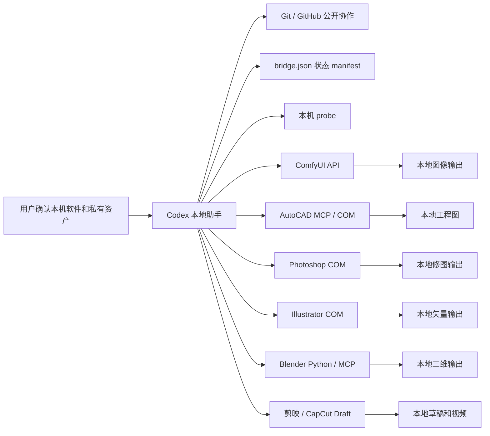

# 星桥三联：主推精确图片转 AI 的本地创意软件桥接框架

> English name: **StarBridge Trinity Protocol**

星桥三联主推“不用图像描摹的精确图片转 SVG / Illustrator AI”：原始 RGBA 像素被重建为矩形复合路径，验证无嵌入位图后再由 Illustrator 存储为 AI。项目同时保留完整的 Windows-first 本地桥接框架：Codex skill 负责选择路线，StarBridge MCP stdio server 注册安全 tools，Adobe UXP / 本地代理连接桌面软件；ComfyUI、Photoshop、CAD、Blender、剪映 / CapCut 等能力继续存在。

人话说：Codex 不直接乱碰 PSD、DWG、模型、草稿和客户素材。它先用 skill 判断路线，再问 StarBridge MCP“这台机器准备好了吗、能安全做什么”，需要 Adobe 插件链路时再走 UXP / Node Proxy；ComfyUI、CAD、Photoshop、Illustrator、Blender、剪映 / CapCut 继续负责真正生成、渲染、修图、矢量化、制图和剪辑。

公开仓库只保存说明、协议、MCP stdio server、示例脚本、workflow、状态 manifest、测试和安全检查。模型、素材、生成图、客户文件、账号、密钥、本机安装路径和输出目录都只留在用户本机。

## 当前定位

- **中文优先**：说明和安全边界用中文写清楚，命令、API、MCP、workflow 等必要术语保留英文。
- **Skill 优先**：仓库先服务 `.codex/skills/starbridge-*`，让 Codex 面对不同软件桥时有明确入口、禁区和验证命令。
- **Windows-first**：当前脚本优先照顾 Windows 本机创作工作站，不能承诺跨平台开箱即用。
- **本机优先**：生成、渲染、修图、矢量化、制图和剪辑由本机软件执行。
- **MCP 可调用**：安全探针、workflow 校验、离线 DXF，以及 Illustrator 彩色矢量化 plan / validate / compare / repair_plan 已经通过 MCP stdio tools 暴露；桌面 execute 仍保持默认 dry-run 与显式确认。
- **UXP 可审计**：Adobe UXP / Node Proxy 只作为本地代理和 typed handler 原型，不开放任意脚本执行，不读取私有 PSD。
- **精确图片转 AI 是主推路线**：普通图片转矢量只走 RGBA 像素→矩形复合 path→验证 SVG→Illustrator Save As AI，不使用 Image Trace，不嵌入位图，不量化颜色。
- **其他矢量协议仍保留**：原生 Image Trace plan / validate / compare / repair_plan / execute 与旧量化 SVG fallback 继续用于兼容、研究和测试，但不作为普通图片转矢量默认入口。
- **公开安全**：GitHub 只保存可复用、可审查、可分享的工程骨架。
- **状态克制**：experimental / research / planned 必须写清楚，不把路线图写成已完成能力。

## 软件桥总览

| 软件桥 | 当前可运行 | 需要本机安装 | 不能做什么 | 下一步 |
| --- | --- | --- | --- | --- |
| ComfyUI | `comfyui.system_probe`、`comfyui.queue_snapshot`、`comfyui.progress_monitor`、`comfyui.job_snapshot`、`comfyui.workflow_validate`、`comfy.workflow_lifecycle_summary`、txt2img API 示例 | Python 3.10+；本机 ComfyUI server；live progress 需 `.[comfy]` 可选依赖 | 不能提交模型或生成图；实时监控与任务快照不返回原始事件、workflow、预览或异常正文 | 补 WebSocket 自动重连、受控 cancel 和 queue payload dry-run |
| CAD / AutoCAD | `cad_autocad.environment_probe`、`autocad_dxf.*`、AutoCAD MCP 子项目 | AutoCAD desktop；pywin32；本机授权；离线 DXF 不要求 AutoCAD | 不能处理客户 DWG 或授权文件；真实 AutoCAD 控制需确认 | 标准化参数、导出和测试 |
| Photoshop | `photoshop.session_info`、诊断、COM 探针、文档信息、主体抠图实验 | 已授权 Photoshop desktop；PowerShell；COM | 不能批量处理私有 PSD；不能承诺生产级自动修图 | 稳定 `document_info`、`extract_subject`、`export_png` |
| Illustrator / AI 矢量文件 | 主推精确 RGBA 像素→已验证 SVG→AI；另有 `illustrator.color_vectorize_*`、环境探测和旧量化 fallback | 主推路线需 Python `.[illustrator-vector]`；AI 交付需已授权 Illustrator | 高复杂度图片会产生大文件；超过安全上限时停止，不回退 Image Trace | 优化复合路径写入与 AI 完成状态证据；继续维护其他协议 |
| Blender | `blender.environment_probe` 和接入说明 | Blender desktop 或 CLI | 还没有公开安全场景生成和渲染闭环 | 补基础场景脚本和渲染探针 |
| 剪映 / CapCut | `jianying_capcut.draft_probe`、调研文档和草稿桥路线 | 剪映专业版或 CapCut desktop；草稿目录 | 不读取私有草稿内容；草稿写入和模板验证未完成 | 补只读草稿目录摘要 |

## 统一入口

```powershell
npm.cmd run status:manifest
npm.cmd run status:manifest:json
npm.cmd run status:probe:json
npm.cmd run starbridge:mcp
npm.cmd run starbridge:tools:safe
npm.cmd run comfy:probe
npm.cmd run comfy:txt2img -- --prompt "a quiet futuristic tea house" --ckpt "<checkpoint-name>"
npm.cmd run photoshop:diagnose
npm.cmd run illustrator:vectorize:offline -- --input "<input.png>" --reference-id reference
npm.cmd run security:check
npm.cmd test
```

`status:manifest` 读取 `examples/*_bridge/bridge.json`，表示仓库配置状态。`status:probe` 探测本机环境，可能因为本机没有安装或没有打开专业软件而显示 `warn` / `missing`。`comfy:txt2img` 会执行真实 ComfyUI 任务，必须先启动 ComfyUI，并显式传入 `--ckpt`。`illustrator:vectorize:offline` 是精确像素矢量重建主入口：不启动 Illustrator、不使用 Image Trace，只接受一个显式输入并写入被 Git 忽略的安全输出目录；源图与输出都不能提交。

## 快速入口

| 入口 | 用途 |
| --- | --- |
| `README.md` | 项目定位、状态表、命令和安全边界 |
| `docs/中文用途索引.md` | 仓库文件中文导航 |
| `docs/starbridge-link-protocol.md` | 桥接协议和状态说明 |
| `docs/01-codex-cad.md` | CAD / AutoCAD 接入说明 |
| `docs/02-codex-comfyui.md` | ComfyUI 接入说明 |
| `docs/03-codex-photoshop.md` | Photoshop 接入说明 |
| `docs/04-codex-blender.md` | Blender 接入说明 |
| `docs/05-codex-illustrator.md` | Illustrator / AI 矢量文件接入说明 |
| `docs/exact-pixel-vectorization.md` | 主推精确像素矢量重建、AI 写入过程和本机脱敏证据 |
| `docs/06-codex-jianying.md` | 剪映 / CapCut 草稿桥调研 |
| `scripts/collect_bridge_status.py` | 汇总 `bridge.json` |
| `examples/bridge_status.py` | 本机软件环境探测 |
| `.github/workflows/ci.yml` | Ubuntu CI：测试、安全检查、manifest 汇总；Windows 桌面软件能力保留为本机验证 |

## 本机路径和个人信息处理

真实路径只放在本机环境变量或本地 `.env`，不要写进公开仓库。

| 项目 | 环境变量 |
| --- | --- |
| ComfyUI API 地址 | `STARBRIDGE_COMFYUI_URL` |
| ComfyUI 根目录 | `COMFY_ROOT` 或 `COMFYUI_PATH` |
| ComfyUI 输出目录 | `COMFY_OUTPUT_DIR` |
| Blender 可执行文件 | `BLENDER_EXE` |
| Blender MCP 桥目录 | `BLENDER_MCP_DIR` |
| AutoCAD 可执行文件 | `AUTOCAD_EXE` |
| Photoshop 可执行文件 | `PHOTOSHOP_EXE` |
| Illustrator 可执行文件 | `ILLUSTRATOR_EXE` |
| 剪映可执行文件 | `JIANYING_EXE` |
| 剪映草稿目录 | `JIANYING_DRAFTS_DIR` |
| CapCut 可执行文件 | `CAPCUT_EXE` |
| CapCut 草稿目录 | `CAPCUT_DRAFTS_DIR` |
| 下载收件箱 | `STARBRIDGE_DOWNLOAD_INBOX` |

## 总体结构



## 安全边界

- 不提交模型、LoRA、VAE、ControlNet、生成图或 ComfyUI 输出目录。
- 不提交客户 DWG、商业图纸、授权文件或真实 CAD 输出。
- 不提交 PSD / AI 私有工程、商业字体、商业笔刷、购买素材、源图和导出结果。
- 不提交 `.blend`、贴图、资产库、渲染缓存或商业模型。
- 不提交剪映 / CapCut 草稿、缓存、导出视频、字幕原稿、账号和会员信息。
- 不提交密码、token、Cookie、OAuth 缓存、浏览器资料和支付信息。

## 验证方式

```powershell
python -m unittest discover -s tests
python scripts\security_check.py
python scripts\collect_bridge_status.py --json
python examples\bridge_status.py --json
```

`examples\bridge_status.py` 是本机探针，未安装软件时可能返回非零退出码；CI 只把它作为信息收集，不要求真实安装 Photoshop、Illustrator、ComfyUI、AutoCAD 或剪映。
